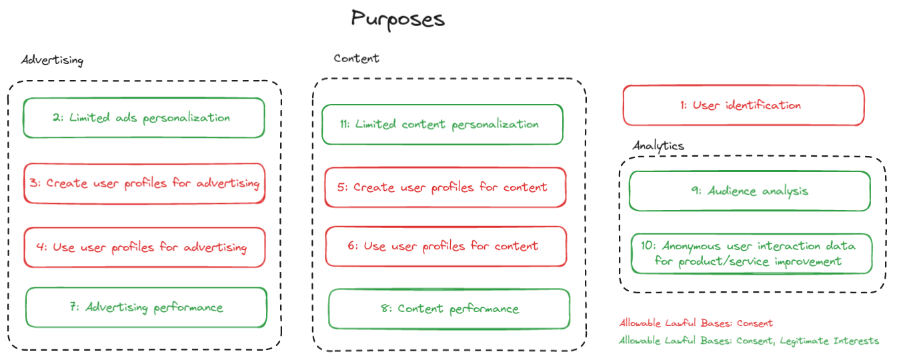
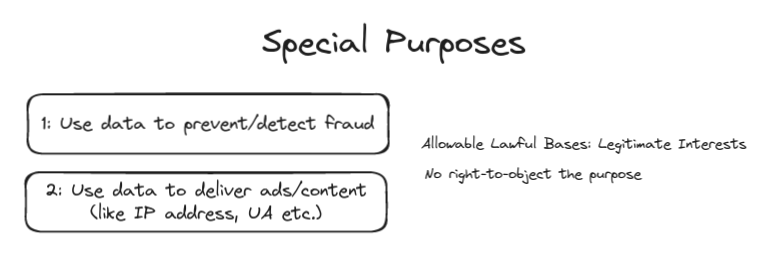

# Transparency and Consent Framework Policies

## Preamble

The goal of the Framework is to help players in the online ecosystem meet General Data Protection Regulation (GDPR) and ePrivacy Directive ("ePD") requirements:

- inform users about 
  - inter alia of storing/accessing information on their devices
  - their personal data is processed
  - purposes for which personal data is processed
  - the companies that are seeking to process their personal data 
- provide users with choices about the same
- signalling to third parties inter alia which information has been disclosed to users and what users' choices are

## Definitions

Signal
: any signal sent by a CMP on behalf of a Publisher to Vendors that includes information about transparency, consent, and status of vendors, purposes, features and restrictions.

Legal Basis
: a lawful ground for processing defined in Article 6 GDPR and supported by the TCF, which are consent in accordance with Article 6(1)(1) GDPR and legitimate interests in accordance with Article 6(1)(f) GDPR.

## Policies for CMPs

- A CMP must disclose Vendors' GVL information

### Managing purposes and legal bases

- A CMP will remind the user of their right to withdraw consent to any vendor or purpose
- A CMP must only generate a positive consent Signal
- A CMP must only generate a positive legitimate interest Signal of the sake of transparency and must always generate a negative legitimate interest Signal if user has objections regarding this
- A CMP must only generate a positive opt-in Signal for Special Features
- A CMP may be instructed by its Publisher with purposes, special featurea, and/pr vendors to disclose
- A CMP must implement any Publisher restrictions

### Working with vendors

- If a CMP works with vendors who are not published on the GVL, the CMP must make it distinguishable for the users

## Policies for Vendors

- A vendor must respect Signals communicated by a CMP or received from a vendor who forwarded the Signal originating from a CMP and act accordingly. A vendor must respect Signals on an individual basis in real-time
- If a vendor is unable to read or process the contents of a received Signal, the vendor must assume that it does not have permissions to store/process information on a device, or process personal data for any purposes
- If a vendor is unable to act in accordance with the contents of a received Signal, the vendor must not store/process information on a device, or process personal data for any purposes
- A vendor must not create Signals where no CMP has communicated a Signal, and shall only transmit Signals communicated by a CMP or received from a vendor without any modifications
- A vendor must update its software used by its Publisher- and Vendor-partners, such as scripts, to comply with the TCF Specification and respect Signals' content
- Where applicable, a vendor must forward the Signal from a CMP or a Vendor to its Vendor-partners present on it services.
- A Vendor must not transmit personal data to another vendor unless the Signals show that the receiving vendor has a Legal Basis for the processing of the personal data
- If a vendor receives a user's personal data without having a Legal Basis for the processing of that data, the vendor must quickly cease processing the personal data and must not further transmit the personal data to any other party

## Policies for Publishers

- A publisher may choose the vendors for which it wishes to provide transparency and may further specify the individual purposes for each vendor. The publisher instructs its CMP regarding its preferences to vendors and purposes
- Publisher may work with vendors that are not in GVL, but must not to confuse users
- Where applicable, a publisher must forward the signal from a CMP to its Vendor-partners present on its services

## Definition of purposes

### Purpose 1: Store and/or access information on device

The following information can be stored or read on users' device to recognize it each time it connects to an app/website:

- cookies (data stored in cookies can help vendor/publisher to recognise your device)
- device or similar identifiers
  - login-based identifiers
  - randomly assigned identifiers (GAID)
  - network based identifiers (IP address)
- together with other information
  - browser type and information
  - language
  - screen size
  - supported technologies

Allowable Lawful Basis: Consent

### Purpose 2: Use limited data to select advertising

Advertising present to you can be based on limited data, such as:

- website or app user is using
- user's non-precise location (accuracy lower than 500m and/or latitude and longitude data that lower than two decimal points)
- user's device type
- content user is interacting with

Allowable Lawful Basis: Consent, Legitimate Interests

### Purpose 3: Create profiles for personalised advertising

Creating or improving a profile about user (possible interests and personal aspects) using:

- user activity on the service
  - submitted forms
  - consumed content
- other information about user
  - user information from previous activity on the service or other websites/apps
- device data
  - device type and capabilities
  - user agent
  - URL
  - IP address

Profile can be used to show personalized advertising.

Allowable Lawful Basis: Consent

### Purpose 4: Use profiles to select personalised advertising 

Advertising presented to you on this service can be based on your advertising profiles.

Requires consent for processing under a legitimate inters for Purpose 2 to be used.

Allowable Lawful Basis: Consent

### Purpose 5: Create profiles to personalise content

Creating or improving a profile about user (possible interests and personal aspects) using:

- user activity on the service
  - submitted forms
  - consumed *non-advertising* content
- other information about user
  - user information from previous activity on the service or other websites/apps
- device data
  - device type and capabilities
  - user agent
  - URL
  - IP address

Profile can be used to show personalized content.

Allowable Lawful Basis: Consent

### Purpose 6: Use profiles to select personalised content

Content presented to you on this service can be based on your content personalisation profiles.

Personalising advertising content is not included in Purpose 6.

Allowable Lawful Basis: Consent

### Purpose 7: Measure advertising performance

Collect information about the relevance of advertising campaigns:

- which ads is presented (shown ads)
- how user interact with ads (clicked ads, redirected to website, product was bought, etc.) 
- measure how brand suitable the content where it was served
- measure the percentage the ads have been shown and for how long
- measure users engagement with the ads (clicks)
- determine how many users/devices and ad was served to
  - time when user saw the ad
  - device characteristics
  - ad attribution, conversions, sales lift
  - report on an individual and aggregate level

Allowable Lawful Basis: Consent, Legitimate Interests

### Purpose 8: Measure content performance

Collect information about the relevance of (non-advertising) content that is shown to user:

- which content is presented
- how user interact with the (non-advertising) content (if it reached its intended audience)
- measure user engagement
  - how long you spend on this service and the web pages you visit
  - mature of the engagement (click, hover, scroll etc.)
- determine how many users/devices and ad was served to
  - time when user spend saw content
  - device characteristics
  - measure user referrals

Allowable Lawful Basis: Consent, Legitimate Interests

### Purpose 9: Understand audience through statistics or combinations of data from different sources

Generating reports regarding user interactions and those of other users with advertising or (non-advertising) content based on combination of data sets:

- user profiles
- statistics
- market research
- analytics data

in order to identify common characteristics.

Allowable Lawful Basis: Consent, Legitimate Interests

### Purpose 10: Develop and improve services

Using information about user interaction with ads or content for improving products and services. The purpose **does not** include creation/update of user profiles and identifiers.

Allowable Lawful Basis: Consent, Legitimate Interests

### Purpose 11: Use limited data to select content

Content present to you can be based on limited data, such as:

- website or app user is using
- user's non-precise location (accuracy lower than 500m and/or latitude and longitude data that lower than two decimal points)
- user's device type
- content user is interacting with

Allowable Lawful Basis: Consent, Legitimate Interests

## Special Purposes

### Special Purpose 1: Ensure security, prevent and detect fraud, and fix errors

User data can be used for:

- monitor/prevent fraudulent activity (ad clicks by bots)
- ensure systems work properly and securely
- for bugs fixing

Special Purpose: No right-to-object to processing under legitimate interests via the Framework,

Allowable Lawful Basis: Legitimate Interests

### Special Purpose 2: Deliver and present advertising and content

In order to ensure the *technical compatibility* of the content or advertising and to facititat the transmission of the content and and to user's device the following information is required:

- IP address
- User Agent type
- Supported language
- Connection type
- Size and type of the ad or content requested

Logging that the ad/content was delivered, without recording any personal data about the user.

Special Purpose: No right-to-object to processing under legitimate interests via the Framework,

Allowable Lawful Basis: Legitimate Interests

