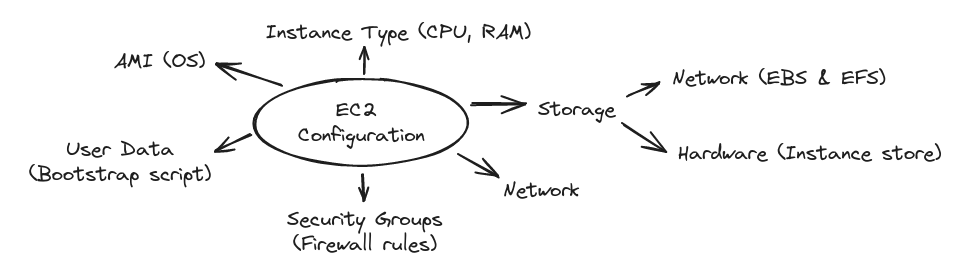
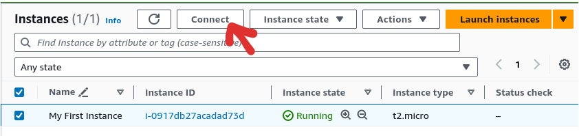
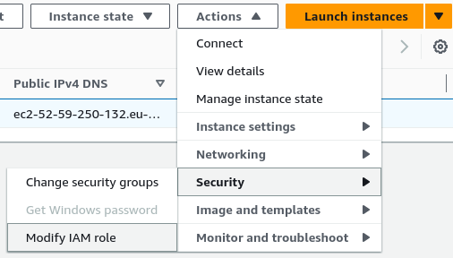

# EC2 - Elastic Cloud Compute - IaaS

- [EC2 Instance Launching](#ec2-instance-launching)
- [EC2 Instance Types](#ec2-instance-types)
- [Security Groups](#security-groups)
- [Secure Shell (SSH)](#secure-shell-ssh)
- [EC2 Instance Connect](#ec2-instance-connect)
- [EC2 IAM Roles](#ec2-iam-roles)
- [EC2 Instances purchasing options](#ec2-instances-purchasing-options)
- []

Some AWS infrastructure components are:

- **EC2:** virtual machines
- **EBS:** virtual drives
- **ELB:** distribution load service
- **ASG:** auto-scaling service

## EC2 Instance Launching

To launch an instance you need to:

1. Name it
2. Select **AMI (Amazon Machine Image)**: OS + architecture
3. Select **instance type** (i.e., t2.micro)
4. Create **Key pair** for **SSH** (optional)
5. Set network settings and **security group** (firewall rules)
6. Configure storage
7. Add **User Data**, i.e. bootstrap script (optional)

## EC2 Instance Types

Classes:

- General Purpose (balanced)
- Compute optimized (CPU intense)
- Memory optimized (RAM intense)
- Storage optimized (Storage intense)

See [instances.vantage.sh](https://instances.vantage.sh) for instance types comparison.

## Security Groups

- control EC2 inbound and outbound traffic
- contain **allow** rules
- can reference by IP address or by security group (**SG**)
- default: all inbound is blocked, all outbound is allowed
- EC2 instances can talk to each other if they share *same* security groups.

TIP: create separate SG for SSH traffic.

### Ports to know

- 22 = SSH
- 21 = FTP
- 22 = SFTP (secure FTP)
- 80 = HTTP
- 443 = HTTPS
- 3389 = RDP

## Secure Shell (SSH)

Amazon EC2 Linux AMI has user called **ec2-user**.

In order to access EC2 instance via SSH:

1. change certificate file's permission `<name>.pem` to read-only:

    `#chmod 0400 <name>.pem`

2. access EC2 instance console using ssh command:

    `#ssh -i <path>\<name>.pem ec2-user@<ec2-instance-public-ip>`

## EC2 Instance Connect

Web-based SSH connection to the EC2 instance

## EC2 IAM Roles

To add IAM Role to EC2 instance you need to use this path via Actions button:

`EC2 > Instances > instance_id > Modify IAM role`

## EC2 Instances purchasing options

- **On-demand instances:** short workload, predictable pricing, pay by second
- **Reserved (1 & 3 years)**
  - Reserved instances: long workloads
  - Convertible reserved instances: long workloads with flexible instances
- **Savings plans (1 & 3 years):** commitment to an amount of usage, long workload
- **Spot instances:** short workloads, cheap, can lose instances (unreliable)
- **Dedicated hosts:** book an entire physical server; control instance placement
- **Dedicated instances:** no one will share your hardware
- **Capacity Reservations:** reserve capacity in a specific availability zone (AZ)

### EC2 on demand

- pay for what you use: Linux/Windows billed per second, rest OS - per hour
- highest cost, no upfront payment
- no long term-commitment
- good for **short-term** and **un-interrupted** workloads

### EC2 reserved instances

- up to 72% discount compared to On-demand
- reserve a specific instance attributes  (type, region, tenancy, OS)
- reservation period: 1 or 3 years
- reserved instance scope: regional or zonal (reserve capacity in an AZ)

**Convertible reserved instance** allows to change the EC2 instance type, family, OS, scope and tenancy with up to 66% discount.

### EC2 Savings Plans

- discount based on long-term usage (up to 72%)
- commit to a certain type of usage ($10/hour for 1 or 3 years)
- usage beyond the plan is billed as On-demand
- locked to instance family and region (i.e. M5 in us-east-1)
- flexible:
  - instance size
  - OS
  - tenancy (host, dedicated, default)

### EC2 Spot Instances

- up to 90% discount
- instance can be lost if you max price < current spot price
- useful for workloads that are resilient to failure

### EC2 Dedicated Hosts

- A physical server with EC2 instance capacity fully dedicated to you
- Purchasing options:
  - On-demand
  - Reserved
- The most expensive option

### EC2 Dedicated Instances

- Instances run on hardware that's dedicated to you
- May share hardware with other instances in same account
- No control over instance placement

### EC2 Capacity Reservations

- Reserve **On-Demand** instances capacity in a specific AZ for any duration
- No time commitment, no billing discounts
