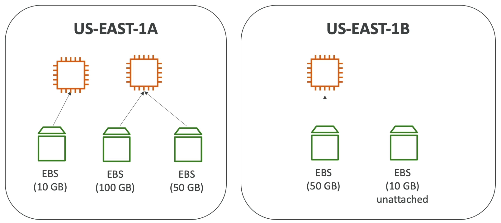

# EC2 Instance Storage

- [EBS Volume](#ebs-volume)
- [EBS - Delete on Termination attribute](#ebs---delete-on-termination-attribute)

## EBS Volume

- an **EBS (Elastic Block Store) Volume** is a **network** drive that can be attached to the instances while they run
- data is persistent even after instances termination
- some EBS volumes can be attached to one instance only, and some support "multi-attach" feature
- EBS volumes are bound to **a specific availability zone**
  - volume in one AZ cannot be attached to the instance in another AZ
  - volume can move across using **snapshot**
- it's a network drive
  - it uses network to communicate the instance
  - it can be detached from one instance and attached to another one
- have a provisioned in advance capacity (size in GiB, and IOPS)
  - billing for the capacity
  - capacity can be increased over time

## EBS - Delete on Termination attribute

- Controls the EBS behavior when an EC2 instance terminates
  - the root EBS volume is deleted by default
  - other attached EBS volumes are not deleted by default (attribute unchecked)
- You can preserve root volume as well by unchecking the attribute

## Inspecting your EBS Volumes

- Select you instance
- Open tab "Storage"
- Select volume in the "Block devices" section

Or go to the left-hand side navigation menu item `Elastic Block Store > Volumes`

## Creating EBS Volume

`EC2 > Volumes > Create volume`

- Choose volume type (i.e. `gp2`)
- Enter volume size in GiB
- Select availability zone (get it from "Networking" tab of the instance)

Volume's "Details" tabs have "Volume state" item:

- `In-use`: volume is attached
- `Available`: volume is detached

## Attaching the volume

`EC2 > Volumes > Actions > Attach volume`

Select the instance to attach to and then click "Attach".

To check if volume is attached go `EC2 > Instances > instance > Storage`

For using new attached volume use this [instruction](https://docs.aws.amazon.com/AWSEC2/latest/UserGuide/ebs-using-volumes.html).

## Deleting the detached volume

`EC2 > Volumes > Actions > Delete volume`

## Detaching the attached volume

`EC2 > Volumes > Actions > Detach volume`

