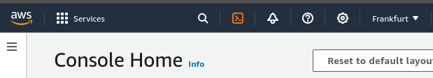

# IAM - Identity and Access Management

1. [IAM: Users & Groups](#iam-users--groups)
2. [IAM: Permissions](#iam-permissions)

## IAM: Users & Groups

- **Root account** shall not be used for daily administrative work.
- **Users** are people with access to AWS services, and can be grouped.
- **Groups** only contains users.


## IAM: Permissions

- **Users or Groups** can be assigned JSON documents - **policies**.
- These policies define the **permissions** of the users.
- AWS applies the **least privilege principle**.


### Create user

`IAM > Users > Create user`

1. Specify user details
2. Set permissions
    - add to the group with policies
    - create the group and attach policies to the group
    - attach policies directly
3. Review and create
4. Retrieve password

### IAM Policies Structure

Consists of

- **Version:** policy language version, always "2012-10-17"
- **Id:** policy identifier (optional)
- **Statement:** one or more statements (mandatory)
  - **Sid:** statement identifier (optional)
  - **Effect:** "Allow" or "Deny"
  - **Principal:** account/user/role to which the policy applied to
  - **Action:** list of actions
  - **Resource:** list of resources to which the actions applied to
  - **Condition:** conditions when the policy is applied (optional)


Administrator policy:

```json
{
  "Version": "2012-10-17",
  "Statement": [
    {
      "Effect": "Allow",
      "Action": "*",
      "Resource":"*"
    }
  ]
}
```

Action wildcard mask implies all actions that start with specified keywords:

- iam:Get*
- iam:List*

Create a policy:

`IAM > Policies > Create policy`

- Specify permissions
  1. Select a service (like IAM)
  2. Specify actions hant can be performed on specific resources in selected service (like, ListUsers)
  3. Choose effect: Allow or Deny
  4. Specify resources ARNs for these actions (all or specific)
  5. Request conditions (optional)
- Review and create
  1. Provide policy details (name and description)
  2. Create the policy

Amazon Resource Names (ARNs)
: uniquely identify AWS resources

## IAM - Password Policy

`IAM > Account Settings > Edit password policy`

- minimum password length
- specific characters types
- users can change their passwords
- password expiration
- prevent password re-use

## Multi Factor Authentication

`IAM > Security credentials > Assign MFA device`

- Both root account and IAM users shall use MFA for account protection
- MFA = password *you know* + security devices *you own*

### MFA devices options in AWS

- Authenticator app (Google Authenticator, Authy)
- Universal 2nd Factor (U2F) Security Key (YubiKey, or other FIDO security key compliant device)
- Hardware TOTP token (time-based one-time password token)

## AWS access options

- AWS Management Console: password + MFA
- AWS Command Line Interface (CLI): access keys
- AWS Software Developer Kit (SDK): access keys

Access keys are generated via AWS Console:

`IAM > Users > username > Create access key`

- Access key ~= username
- Secret access key ~= password

## AWS CLI

```
  #aws configure
  AWS Access KEy ID: <access key>
  AWS Secret Access Key: <secret access key>
  Default region name: eu-central-1
```

## CloudShell

Web-based CLI alternative. No need to generate access keys. Is some regions is not available.



Files, created in the CloudShell environment are *persistent*.

You can upload/download the files in CloudShell.


## IAM Roles for Services

**IAM Roles** provides permissions to AWS services to perform actions on your behalf.

Common roles:

- EC2 Instance Roles
- Lambda Function Roles
- Roles for CloudFormation

### Creating an IAM role

`IAM > Roles > Create role`

1. Select trusted entity (AWS service, AWS account, etc.)
2. Add permissions (policies)
3. Name, review, and create

Trust policy example:

```json
{
    "Version": "2012-10-17",
    "Statement": [
        {
            "Effect": "Allow",
            "Action": [
                "sts:AssumeRole"
            ],
            "Principal": {
                "Service": [
                    "ec2.amazonaws.com"
                ]
            }
        }
    ]
}
```

## IAM Security Tools

- **IAM Credentials Report** (account-level)
  - list the user and status of their credentials
  - `IAM > Credential Report`
- **IAM Access Advisor** (user-level)
  - list of service permissions and last access to the services
  - `IAM > Users > username`, then tab `Access Advisor`

## Shared responsibility Model for IAM

| AWS | You |
| - | -|
Infrastructure (global network security) | Users, Groups, Roles, Policies management and monitoring
Configuration and vulnerability analysis | Enable MFA on all accounts
Compliance validation | Rotate all your keys often
| | Use IAM tools to apply appropriate permissions
| | Analyze access patterns & review permissions