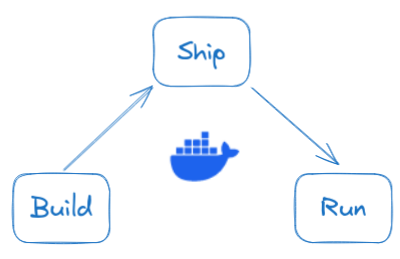
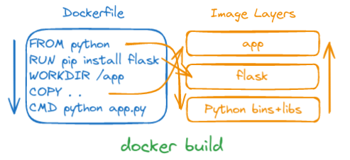
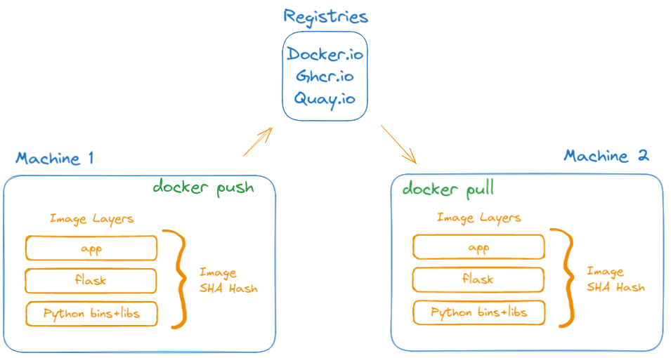
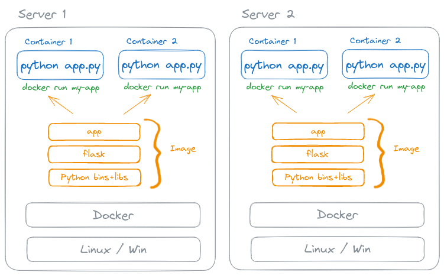

# What is Docker?

## Three major innovations

1. [The Docker image](#the-docker-image-the-build-step)
2. [The Docker registry](#the-docker-registry-the-ship-step)
3. [The Docker container](#the-docker-container-the-run-step)

## Build, Ship, Run concept

1. Take an application and turn it into the Docker image
2. Put it on a registry
3. Get image on the target location, and create a container from it.

## The Docker image (The Build step)

> Universal app packaging

Dockerfile
: A recipe to make a container image

`#docker build` command will take a dockerfile and create the Docker image.

## The Docker registry (The Ship step)

> Universal app distribution

The Docker registry is used to store and distribute Docker images.

`#docker push` uploads the image to the registry.

`#docker pull` get identical copy of the image from the registry.

## The Docker container (The Run step)

> Identical runtime environments

`#docker run` runs application in its own container.

Container will have own namespace that creates a sort of isolated OS where application is running:

- own blank file system
- own NIC and IP address
- own process list

Containers that run on the same machine are isolated from each other.

We can build high-available systems by deploying the containers multiple times on the distributed servers.
