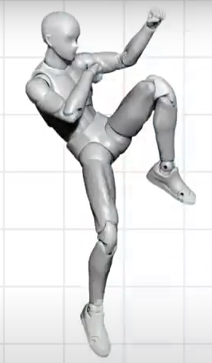

# Assigning Animations

In game dev, "animation" refers to the way characters and other elements move.

When you plan characters (fighters, i.e), you need to consider how their actions might be animated, and communicating those ideas to the animation team is vital.

## Communicating with Animators

First, it's essential to create an animation list. This is a written document that lists up all of the animations in the game.

At this stage of the process all movements are described via text. You also shall note *animation length*, as well as when the attack itself occurs. Keeping the game's "push and pull" in mind, you shall choose timings that feel right at this stage.

For the movements that can loop, such as idle or walk animations, you shall write "Loop" or "Any" for the timing.

Next, to communicate crucial poses like idling, movement, and attacks, you can use mannequin - a figure you can pose and take photos of:

- take you figure
- photograph it
- cut shape
- adjust contrast
- incorporate it into your spec sheet

One fighter on average will get between 70 to 80 pages of these images.

For fighters that aren't remotely humanoid, you might leave out visual reference entirely and  stick to text alone.

To make these into good animations, the animators need to fill in gaps and figure out details. There's really a lot they need to consider.
