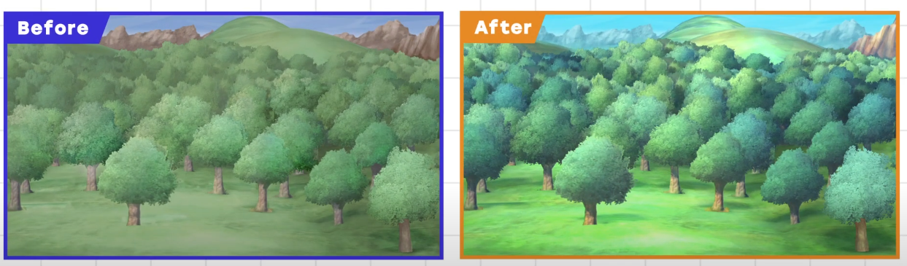

# Draw the Light, Not the Asset

**Draw the Light the asset reflects.**

Everything we see is actually the light an object reflects when it enters our eyes. It's not as simple as seeing a red thing as red or blue thing as blue.

In terms of hardware performance, the less we process an object, the more of it we can put on screen. Which means it's better to go for simpler techniques when possible.

In order to improve an asset:

- add *light*. Colored light shining down on the scene creates contrast along the group.
- vary *hues*. Bring variety to your palette. Slight variations in hue will give the piece more impact. Light scatters as it reflects, after all.
- Inject *atmosphere*. The good atmosphere can bring depth and distance to the world in the scene.

There are other methods, like adding fog for the perspective, applying brightness filter in the direction of sunlight, etc.

The final product, more than anything, should express the light your asset reflects in the environment.
