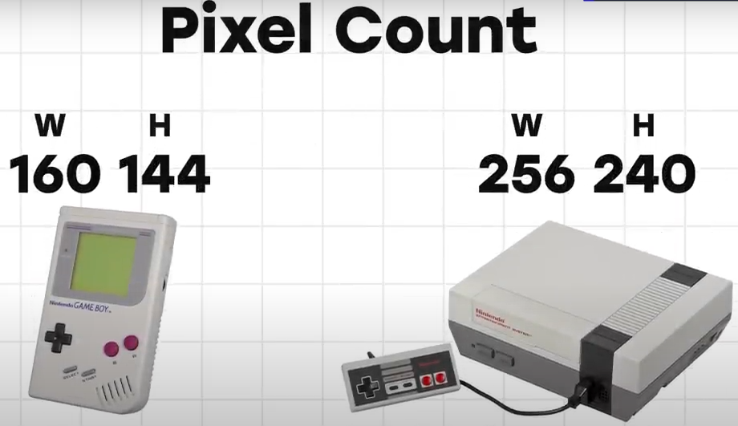

# Kirby's Adventure

*Kirby's Adventure* is the second installment in the *Kirby* series, and the first to feature his iconic copy ability.

If the specific console market had already matured, developing beginner friendly game will probably not so good idea. There wouldn't be many beginners starting out with the system anymore.

Challenge: "How do I make something both beginners *and* veterans can enjoy? More than that, how do I *satisfy* them?"

Ability to copy enemies traits takes the original concept of "using enemies" one step further.

Players who aren't used to complex game mechanics can finish the game just by inhaling enemies and spitting them out.

Whereas more experienced players can dig deep into the copy abilities and broaden their play experience.

There's something there for everyone. If you do use copy abilities, certain parts might be more fun or you might be able to pull off tricks, but you can technically play from start to finish just inhaling enemies and spitting them out.

There are extract from the design document.

The copy ability also greatly increased Kirby's appeal as a character. Just watching him change forms and get new powers is fun in its own right. 

And it makes you look forward to each new enemy encountered. Every individual enemy now had meaning, which is a huge deal.

The Game Boy and the NES display a different number of pixels on-screen.

Game with same number of pixels will look smaller on bigger screen and aspect ratio can be different.

Informational panel for NES was expanded to restrict vertical space and make character look bigger, and provide fun pictures of each copy ability.

Mid-boss fights was confined to just one screen to limit the utility of fight.
