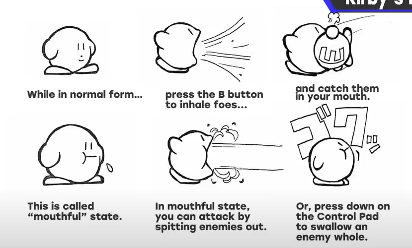

# Kirby's Dream Land

Main concept to get fun if the player could use enemies. It's about risk and reward and the dual purpose that enemies serve.

Kirby inhales enemies and spits them out.

Kirby has one more key trait. He has the ability to fly, because designer thought it was too harsh to lose a life just for missing a jump. Think about being hit by an enemy versus falling into a pit. Neither one is too serious a mistake, but even in action games with health bars, falling usually meant instant death.

So designer kept the penalty of losing a life if player fall, but gave players the ability to fly over these gaps. Player could use this to skip enemies, too.

Inhaling enemies and flying both reduced the potential risks players faced during gameplay. But this made first *Kirby* as accessible as possible for new players. **Provide an entry point for new players.**

Some games end when you beat them, but others, like arcade games, aren't so easy to down. If it's fun, you'll play it again and again.

Pay attention to use the music. For example each stage can begin right after the musical intro, or musical victory signature.

More beginner friendly -> more broad appealing -> better selling game.
