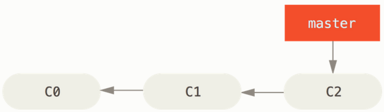
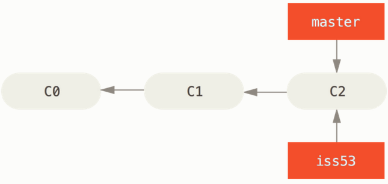
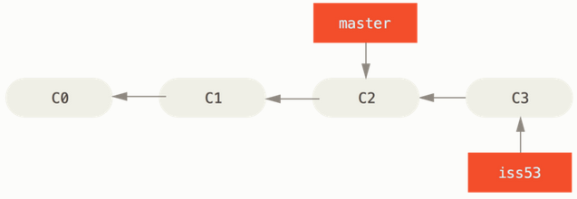
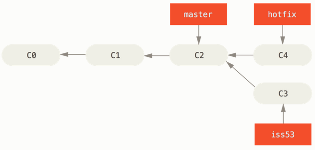
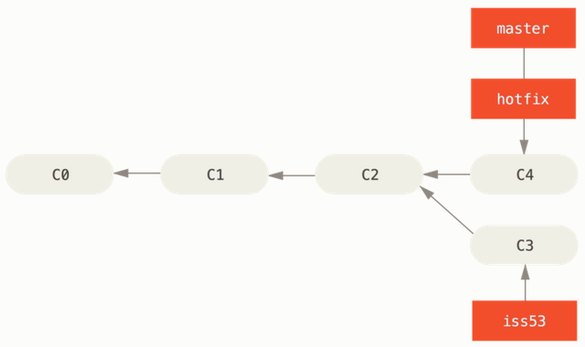
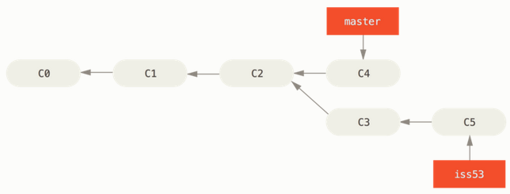

# Git Branching - Basic Branching and Merging

Here is a sample workflow:

1. Do some work on a website.
2. Create a branch for a new user story you're working on.
3. Do some work in that branch.
4. You've been informed about critical issue for which you need to do a hotfix..
5. Switch to your production branch.
6. Create a branch to add the hotfix.
7. After it's tested, merge the hotfix branch, and push to production.
8. Switch back to your original user story and continue working.

## Basic branching

let's say your project has several commits on the `master` branch.



You've decided to work on the issue #53. Let's create a new branch pointer.

```
$ git checkout -b iss53
```

The `-b` flag is used to create a new branch and to switch to it at the same time.



You've done some commits, this moving the `iss53` branch forward, because you have it checked out (that is, your `HEAD` is pointing to it):

```console
$ vim index.html
$ git commit -a -m 'Create new footer [issue 53]'
```



Now you get the call about the critical bug that need to be fixed.

Git won't let you switch branches if you working directory or staging area has uncommitted changes. It's best to have a clean working state when you switch branches.

So you committed the changes and can switch back to `master` branch:

```console
$ git checkout master
```

Remember: when you switch branches, Git resets your working directory to look like it did the last time you committed on that branch.

Next, you have a hotfix to make. Let's create a `hotfix` branch on which to work until it's completed:

```console
$ git checkout -b hotfix
$ vim index.html
$ git commit -a -m 'Fix broken email address'
```



You can run your tests, make sure the hotfix is what you want, and finally merge the `hotfix` branch back into your `master` to deploy to production.

```console
$ git checkout master
$ git merge hotfix
Updating f42c576..3a0874c
Fast-forward
```

The phrase "fast-forward" means that Git simply moves `master` pointer forward as commit C4 was directly ahead of the commit C2, thus there is no divergent work to merge together.

You change is now in the snapshot of the commit pointed to by the `master` branchm and you can deploy the fix.



After the fix deployed, you're ready to switch back to the work related to issue 53. However, you need to delete the `hotfix` branch, because you no longer need it - the `master` branch points at the same place. You can delete it with the `-d` option to `git branch`.

```console
$ git branch -d hotfix
```

Now you can switch back to your work-in-progress branch:

```console
$ git checkout iss53
```



In order to pull the changes in the `iss53` into the `master` branch you first need to pull changes related to the `hotfix` that is not yet in the `iss53` branch by merging `master` branch into your `iss53` branch by running `git merge master`.
