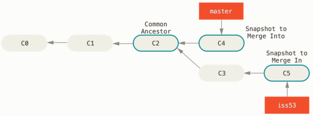
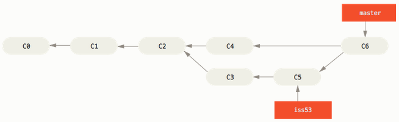

# Git Branching - Basic Branching and Merging

Here is a sample workflow:

1. Do some work on a website.
2. Create a branch for a new user story you're working on.
3. Do some work in that branch.
4. You've been informed about critical issue for which you need to do a hotfix..
5. Switch to your production branch.
6. Create a branch to add the hotfix.
7. After it's tested, merge the hotfix branch, and push to production.
8. Switch back to your original user story and continue working.

## Basic branching

let's say your project has several commits on the `master` branch.


You've decided to work on the issue #53. Let's create a new branch pointer.

```
$ git checkout -b iss53
```

The `-b` flag is used to create a new branch and to switch to it at the same time.


You've done some commits, this moving the `iss53` branch forward, because you have it checked out (that is, your `HEAD` is pointing to it):

```console
$ vim index.html
$ git commit -a -m 'Create new footer [issue 53]'
```


Now you get the call about the critical bug that need to be fixed.

Git won't let you switch branches if you working directory or staging area has uncommitted changes. It's best to have a clean working state when you switch branches.

So you committed the changes and can switch back to `master` branch:

```console
$ git checkout master
```

Remember: when you switch branches, Git resets your working directory to look like it did the last time you committed on that branch.

Next, you have a hotfix to make. Let's create a `hotfix` branch on which to work until it's completed:

```console
$ git checkout -b hotfix
$ vim index.html
$ git commit -a -m 'Fix broken email address'
```


You can run your tests, make sure the hotfix is what you want, and finally merge the `hotfix` branch back into your `master` to deploy to production.

```console
$ git checkout master
$ git merge hotfix
Updating f42c576..3a0874c
Fast-forward
```

The phrase "fast-forward" means that Git simply moves `master` pointer forward as commit C4 was directly ahead of the commit C2, thus there is no divergent work to merge together.

You change is now in the snapshot of the commit pointed to by the `master` branchm and you can deploy the fix.


After the fix deployed, you're ready to switch back to the work related to issue 53. However, you need to delete the `hotfix` branch, because you no longer need it - the `master` branch points at the same place. You can delete it with the `-d` option to `git branch`.

```console
$ git branch -d hotfix
```

Now you can switch back to your work-in-progress branch:

```console
$ git checkout iss53
```


In order to pull 'hotfix' changes into the `iss53` you need to pull the changes by merging `master` branch into your `iss53` branch by running `git merge master`.

## Basic  merging

In order to merge `iss53` branch into `master` you need to check out the branch you wish to merge into and then run the `git merge` command:

```console
$ git checkout master
$ git merge iss53
Merge made by the 'recursive' strategy
```

Because the commit on the branch you're on isn't a direct ancestor of the branch you're merging in, Git does a three-way merge, using the two snapshots pointed to by the branch tips and the common ancestor of the two.



Instead of just moving the branch pointer forward, Git creates a new snapshot that results from this three-way merge and automatically creates a new commit that points to it. This is referred to as a merge commit, and is special in that it has more than one parent.



Now that your work is merged in, you have no further need for the `iss53`. 

```
$ git branch -d iss53
```

## Basic merge conflicts

If you changed the same part of the same file differently in the two branches you're merging, Git won't be able to merge them cleanly.

Git hasn't automatically created a new merge commit. It has paused the process while you resolve the conflict. If you want to see which files are unmerged at any point after a merge conflict, you can run `git status`.

Anything that has merge conflicts and hasn't been resolved is listed as unmerged. Git adds standard conflict-resolution markers to the files that have conflicts, so you can open them manually and resolve those conflicts. Your file contains a section that looks something like this:

```html
<<<<<<< HEAD:index.html
<div id="footer">contact : email.support@github.com</div>
=======
<div id="footer">
 please contact us at support@github.com
</div>
>>>>>>> iss53:index.html
```

This means the version in `HEAD` is the top part of that block (everything above the `=======`), while the version in your `iss53` branch looks like everything in the bottom part. In order to resolve the conflict, you have to either choose one side or the other or merge the contents yourself.

After you've resolved each of theses sections in each conflicted file, run `git add` on each file to mark it as resolved. Staging the file marks it as resolved in Git.

If you want to use a graphical tool to resolve these issues, you can run `git mergetool`.

You can run `git status` to verify that all conflicts have been resolved.

If you're happy with that, and you verify that everything that had conflicts has been staged, you can type `git commit` to finalize the merging commit.


