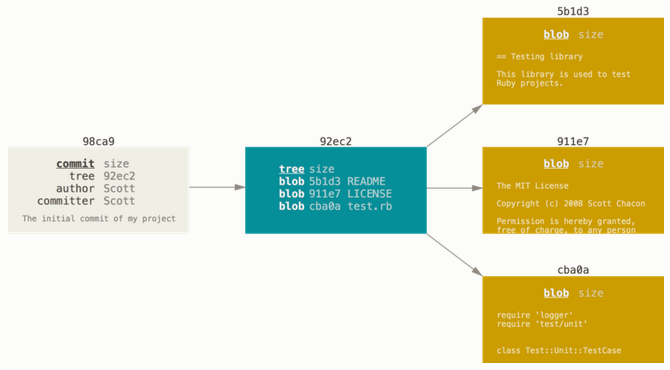
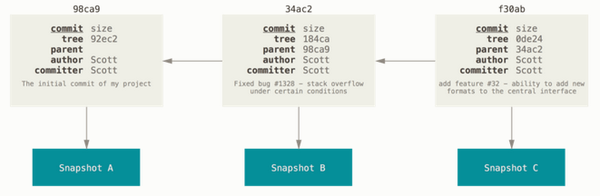
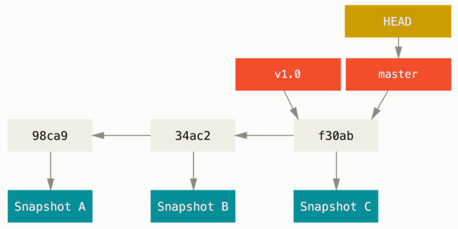
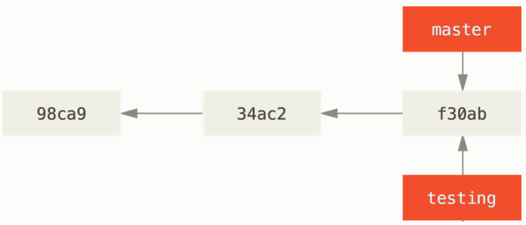
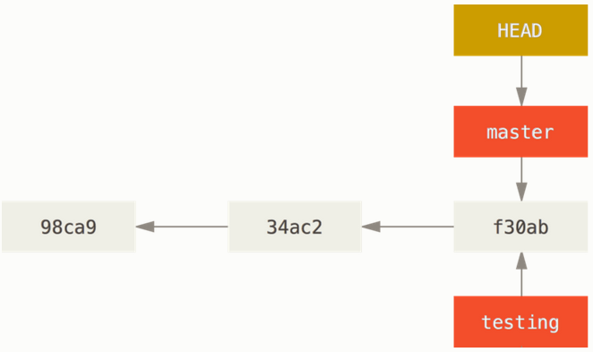
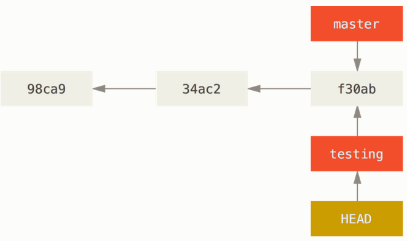
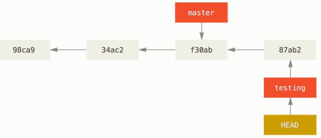
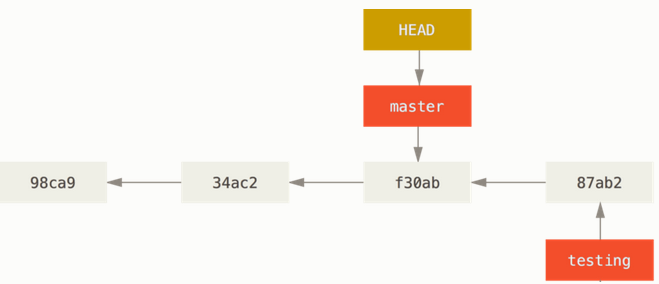
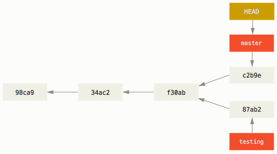

# Git Branching - Branches in a Nutshell

Git store data as a series of **snapshots.** Git takes a picture of what all files look like (a miniature filesystem) at that moment and stores a reference to that snapshot. If files have not changed, Git doesn't store the file again, just a link to the previous identical file.

When you make a commit, Git stores a commit object that contains a pointer to the snapshot of the content you staged. This object also contain pointers to the commit or commits that directly came before this commit (parents):

- zero parents for the initial commit
- one parent for a normal commit
- multiple parents as a result of merge multiple branches

Staging the files

- computes an SHA-1 checksum for each one,
- stores that version of the file in the Git repository (**blobs**), and
- adds that checksum to the staging area

When you create the commit, Git

- checksums each subdirectory
- stores them as a tree object in the Git repository
- creates a commit object that has the metadata and a pointer to the root project tree so it can re-create that snapshot when needed.



If you make some changes and commit again, the next commit stores a pointer to the commit that came immediately before it.



A branch in Git is simply a lightweight movable pointer to one of these commits. The default branch name in Git is `master`. As you start making commits, you're given a `master` branch that points to the last commit you made. Every time you commit, the `master` branch pointer moves forward automatically.



## Creating a new branch

When you create a new branch, you create a new pointer for you to move around.

```
$ git branch testing
```

This creates a new pointer to the same commit you're currently on.



A special pointer called `HEAD` is a pointer to the local branch you're currently on. The `git branch` command only **created** a new branch - it didn't switch to that branch.



## Switching branches

To switch to an existing branch, you run the `git checkout` command.

```
$ git checkout testing
```

This moves `HEAD` to point to the `testing` branch.



After we creating another commit the HEAD branch moves forward to the new commit.



Let's switch back to the `master` branch:

```
$ git checkout master
```



That command did two things:

- it moved the HEAD pointer back to the `master`
- it retrieved the files in your working directory back to the snapshot that `master` points to

It essentially rewinds the work you've done in your `testing` branch so you can go in a different direction.

Let's make a few changes and commit again. Now your project history has diverged (separated). The changes are isolated in separate branches: you can switch back and forth between the branches and merge them together when you're ready.



You can see graphical representation of all history of your commits if you run 

```console
git log --oneline --decorate --graph --all
```

Because a branch in Git is actually a simple file that contains the 40 character SHA-1 checksum of the commit it points to, branches are cheap to create and destroy.

Because we're recording the parents when we commit, finding a proper merge base for merging is automatically done for us and is generally very easy to do.

## Creating a new branch and switching to it at the same time

```console
$ git checkout -b <newbranchname>
```

## Using `git switch` instead of `git checkout`

From Git version 2.23 onwards you can use `git switch`.

| Command | Effect |
|-|-|
| `git switch existing_branchname` | Switch to existing branch |
| `git switch -c new-branch` | Create a new branch and switch to it |
| `git switch -` | Return to your previously checked out branch |

