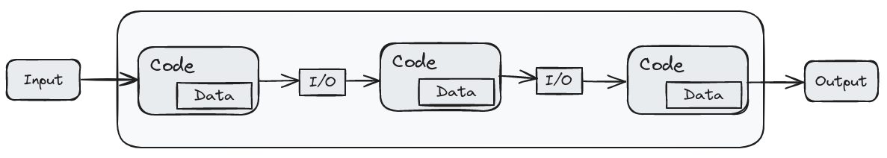

# Computation

> "If it doesn't have to produce correct results, I can make it arbitrarily fast." - Gerald M. Weinberg

- [Objectives and tools](#objectives-and-tools)
- [Expressions](#expressions)
- [Statements](#statements)

From a broad view, all that a program ever does is to compute; that is, it takes some inputs and produces some output.

To deal with input, a program usually contains some data, referred to as its *data structures* or its *state*.

From a programming point of view the most important categories of input and output are "to/from another program" and "to/from other parts of a program". 

The key questions in programming are:

- How do we express a program as a set of cooperating parts?
- How can they share and exchange data?



The abbreviation I/O stands for "input/output". In this case, the output from one part of the code is the input for the next part. What such "part of a program" share is data stored in main memory, on persistent storage devices, or transmitted over network connections. By "parts of a program" we mean entities such as a function.

Inputs to a functions are called *arguments* and outputs from them are called *results*.

By *computation* we mean the act of producing some outputs based on some inputs.

## Objectives and tools

Our job as programmers is to express computations:

1. Correctly
2. Simply
3. Efficiently

In this order only. Concerns about correctness, simplicity, and efficiency become ours the minute we start writing code for others and accept responsibility to do that well. 

Our main tool for organizing a program and our thoughts as we program is to break up a big computation into many little ones:

- *Abstraction*: Hide details that we don't need to use a facility ("implementation details") behind a convenient and general interface.
- *"Divide and conquer"*: Here we take a large problem and divide it into several little ones. Each of the resulting problems is significantly smaller than the original.

We are not very good at dealing with large problems. We simply cannot write and maintain large monolithic programs, so we are composing large programs with a set of small parts.

A good library, supplying useful facilities for expression ideas, can crucially affect the way we distribute functionality into different part of a program. If you use existing library you can safe yourself a lot of work on programming, on testing, and documentation. This is a first example of partitioning a program using abstractions.

Good programmers and system designers know that concerns about code *structure* and *organization* lie at the heart of good software and that ignoring structure leads to expensive messes.

## Expressions

The most basic building block of programs is an *expression*. An expression computes a value from a number of operands. The simplest expression is simply a literal value, such as 10, 'a', or "Norah".

Names of variables are also expressions. A variable represents the object of which it is the name.

```c++
int length = 20;  	// the rvalue of length - the object named by length
int area = length * 10; // the lvalue of length - the value of the object named by length
```

Sometimes (as an lvalue) **length** refers to the box (object) and sometimes (as an rvalue) **length** refers to the value in that box.

We can make more complicated expressions by combining expressions using operators and parentheses to group expressions.

```c++
int perimeter = (length+width)*2;
```

The usual mathematical rules of operator precedence apply. The first rule for the use of parentheses is simply "If in doubt, parenthesize". Use parentheses sparingly, as their overuse decreases readability.

Ugly code slow downs reading and comprehension. Don't write absurdly complicated expressions and always try to choose meaningful names.

### Constant expressions

Program  typically use a lot of constants. C++ offers the notion of a symbolic constant, a named object to which you can't give a new value after it has been initialized.

```c++
constexpr double pi = 3.14159;
pi = 7;		// error: assignment to constant
```

Such constants are useful for keeping code readable. It's easy to change it once in the code. You should use this tool and avoid magic constants.

In some places, such as **case**, C++ requires a *constant expression*, that is, as expressions with an integer value composed exclusively of constant.

```c++
constexpr int max = 17;
max+2;	// a constant expression
```

A **constexpr** symbolic constant must be given a value that is known at compile time.

```c++
constexpr int max = 100;
int n;
constexpr int c1 = max+7; // OK: c1
constexpr int c2 = n+7;	  // error: we don't know the value of c2
```

C++ offers a second form of constant (a **const**) that initialize a "variable" with a value that is not known at compile time but never changes after initialization.

```c++
int n;
const int c1 = n+7; //OK. but you cannot change value of c1
c1 = 7; 	    // error: c1 is a const
```

### Operators

Most operators are conventional.

|			| Name				| Comment 					|
| --------------------- | ----------------------------- | --------------------------------------------- |
| **f**(**a**)		| function call			| pass **a** to **f** as an argument		|
| ++**lval**		| pre-increment			| increment and use the incremented value	|
| --**lval**		| pre-decrement			| increment and use the incremented value	|
| !**a**		| not				| result is **bool**				|
| -**a**		| unary minus			|						|
| **a**`*`**b** 	| multiply			|						|
| **a**/**b**		| divide			|						|
| **a**%**b**		| modulo (reminder)		|						|
| **a**+**b**		| add				|						|
| **a**-**b**		| subtract			|						|
| **out**<<**b**	| write **b** to **out**	| where **out** is an **ostream**		|
| **in**>>**b**		| read from **in** into **b**	| where **in** is an **istream**		|
| **a**<**b**		| less than			| result is **bool**				|
| **a**<=**b**		| less than or equal		| result is **bool**				|
| **a**>**b**		| greater than			| result is **bool**				|
| **a**>=**b**		| greater than or equal		| result is **bool**				|
| **a**==**b**		| equal				| not to be confused with 			|
| **a**!=**b**		| not equal			| result is **bool**				|
| **a**&&**b**		| logical and			| result is **bool**				|
| **a**||**b**		| logical or			| result is **bool**				|
| **lval** = **a**	| assignment			| not to be confused with ==			|
| **lval** `*=` **a**	| compound assignment		| **lval** = **lval**`*`**a**; also for /,%,+,-	|	

We used **lval** (short for "value that can appear on the left-hand side of an assignment") where the operator modifies an operand.

In general, a way of saying something in a program is better that another if it more directly expresses ad idea. The result is more concise and easier for a reader to understand.

```c++
++a;
a+=1;
```

Here `++a` more directly expresses the idea of incrementing.

Similarly, we prefer `a*=scale` over `a=a*scale`.

### Conversions

We can "mix" different types in expressions. The rule is that if an operator has an operand of type **double**, we use floating-point arithmetic yielding a **double** result; otherwise, we use integer arithmetic yielding an **int** result.

```
5/2 is 2 (not 2.5)
2.5/2 means 2.5/double(2), that is, 1.25
'a'+1 means int{'a'}+1
```

The notation **type(value)** and **type{value}** mean "convert **value** to **type** as if you were initializing a variable of type **type** with the value **value**".

The notation **type{value}** prevents narrowing, but the **type(value)** notation does not.

```c++
double d = 2.5;
int i = 2;

double d2 = d/i;  // d2 == 1.25
int i2 = d/i; 	// i2 == 1
int i3 {d/i};	// error: double -> int conversion may narrow
```

Beware that it is easy to forget about integer division in an expression that also contains floating-point operands.

## Statements

An expression computes a value from a set of operands using some operators.

In C++ you use language constructs called *statements* to express things like:

- producing several values
- repeating something
- choosing among alternatives
- get input or produce output

### Declaration statement

```c++
int a = 7;
```

### Expression statement

An expression statement is simply an expression followed by a semicolon.

```c++
a = b;
++b;
```

In general, we want a statement to have some effect. Thus, expression statements are typically assignments, I/O statements, or function calls.

With not careful placing of semicolon you can create an *empty statement*, a statement doing nothing: 

```c++
if (x == 5);
```

### Selection

#### if-statements

The simplest form of selection is an **if**-statement, which selects between two alternative.

```c++
if(a<b)
    cout << a << " < " << b << "\n";
else
    cout << b << " < " << a << "\n";
```

If its condition is true, the first statement is executed; otherwise, the second statement is.

We tend to make programs assuming that the user enters proper input. It's not always the case, unfortunately.

We must always test our programs with "bad" input. A program should behave sensibly even is its users don't.

The general form of an **if**-statement is

```c++
if (expression)
    statement
else
    statement
```

We can use an **if** statement as the **else** part of an **if**-statement (there is no an "**else-if**-statement" in C++):

```c++
if (expression)
    statement;
else if (expression)
    statement;
else
    statement;
```

In this way, we can write arbitrarily complex tests ans associate a statement with each alternative. However, please remember that one of the ideals for code is simplicity, rather than complexity.


