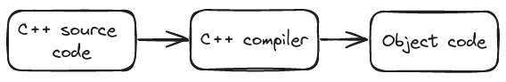
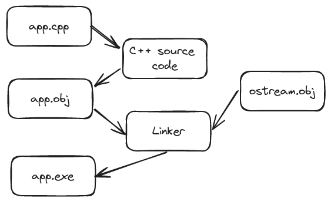

# Hello, World!

> "Programming is learned by writing programs." -Brian Kernighan

- [Program](#programs)
- [The classic first program](#the-classic-first-program)
- [Compilation](#compilation)
- [Linking](#linking)
- [Programming environments](#programming-environments)

## Programs

Human instructions using human language are vague and incomplete. A human easily compensates it by using common sense.

Computers are *really* dumb. They have to have everything described precisely and in detail. For this we need to define a language with a specific grammar and well-defined vocabulary for the kinds of actions we want performed - a *programming language*.

## The classic first program

```c++
// This program output the message "Hello, World!" to the monitor

#include "../std_lib_facilities.h"

int main()
{
    cout << "Hello, World!\n";
    return 0;
}
```

The program will write **Hello, World!** to the screen, and the it will return a value **0** (zero), which indicates that the program terminated successfully.

Remember: code is for reading - do all you can to make it readable.

`//` is the token used to write comments. Comments are used to provide information for human readers and are ignored by the compiler.

`#include "file.h"` is a directive to make available facilities from a *header* or a *header file*. A header contains definitions of terms that is used in the program.

Every C++ program must have a function called `main` to tell computer where to start executing.

A **function** is a named sequence of instructions for the computer to execute in the order in which they are written.

A function's parts:

- A *return type*: what kind of result, if any, the function will return
- A *name*
- A *parameter list*: list of parameters enclosed in parentheses
- A *function body*: list of *statements* (actions) enclosed in curly braces

The name `cout` refers to a standard output stream. Characters "put into **cout**" using the output operator `<<` will appear on the screen.

String literals are delimited by double quotes (").

Many C++ statements are terminated by a semicolon (;) for compiler to distinguish the statements.

## Compilation

C++ is a compiled language. In order to produce executable file, a program called *compiler* translates *source code* files (`*.cpp` or `*.h`) written by humans into *executable*, *object code*, or *machine code* (`*.obj`, or `*.o`) that machine can "understand".



The compilers are picky about syntax and have zero tolerance for spelling mistakes.

You will spend a lot f time looking for errors in the program source code. The compiler saves us from a lot of self-inflicted problems.

## Linking

A program usually consists of several separate parts (*translation units*) that must be complied to object code files that in turn must be linked together to form an executable program. The program that links object code files called *linker*.



Note. Object code and executable are *not* portable among systems.

A *library* is some code written by others and accessible via `#include` declaration.

A *declaration* is a program statement specifying how a piece of code can be used.

Errors found by the compiler are called *compile-time errors*, errors found by the linker are called *link-time errors*, and errors not found until the program is run are called *run-time errors* or *logic errors*.

## Programming environments

Programming development environment includes:

- A program language
- A program to edit source code text
- A compiler to translate source code into object code
- A linker to link object code into executable program

You can use a command-line interface and do all stuff manually, or take advantages of an IDE ("interactive/integrated development environment").

An IDE have additional features like syntax highlighting and debugging.

*Debugging* is the activity of finding errors in a program and removing them.
