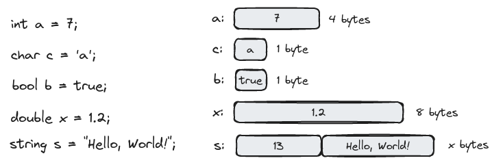

# Objects, Types, and Values in C++

> "Fortune favors the prepared mind." - Louis Pasteur

- [Input](#input)
- [Variables](#variables)
- [Input and type](#input-and-type)
- [Operations and operators](#operations-and-operators)
- [Assignment and initialization](#assignment-and-initialization)
- [Composite assignment operators](#composite-assignment-operators)
- [Names](#names)
- [Types and objects](#types-and-objects)
- [Type safety](#type-safety)

## Input

Real programs tend to produce results based on some input we give them.

An *object* is a region of memory with a *type* that specifies what kind of information can be placed in it.

A named object is called a *variable*.

You can think of an object as a "box" into which you can out a value of the object's type:


```c++
// read and write a first name
#include "../std_lib_facilities.h"

int main()
{
    cout << "please enter your first name (followed by 'enter'):\n";
    string first_name;  // first_name is a variable of type string
    cin >> first_name;  // read characters into first_name
    cout << "Hello, " << first_name << "!\n";
}
```

A *prompt* message prompts the user to take an action.

A *definition* is a statement that introduces a new name into a program and sets aside memory for a variable.

```c++
int age;
string first_name;
```

The name `cin` refers to the standard input stream ("see-in", for "character input") defined in the standard library.

The `>>` operator specifies where the input goes. 

Until a newline is entered (the Enter key is hit), the computer simply collects characters. The newline *will not be* part of the string stored in memory.

We use quotes when we want a literal string. When we don't use quote, we refer to the value of something with a name.

## Variables

- *objects*: the "places" in which we store data
- *variable*: a named object that has specific *type*
- *type*: (**int** or **string**) determines what can be put into the object (**123**, or **"Hello"**) and which operations can be applied (multiplication for **int**s, or concatenation for **string**s)
- *values*: the data items we put into variables
- a *definition*: a statement that defines a variable

You cannot put values of the wrong type into a variable - compiler will issue an error during the compilation process.

The most common set of C++ types:

```c++
int number_of_steps = 39;   // int for integer
double flying_time = 3.5;   // double for floating-point numbers
char decimal_point = '.';   // char for individual characters
string name = "Annamarie";  // string for characters strings
bool tap_on = true;         // bool for logical variables
```

Note that each of these types has its own characteristic style of literals.

## Input and type

The input operation `>>` ("get from") is sensitive to type; that is, it reads according to the type of variable you read into.

```c++
string first_name;
int age;
cin >> first_name;  // read a string
cin >> age;         // read an integer
```

By convention, reading of strings is terminated by what is called *whitespace* (space, newline, and tab characters); that is, it reads a *single* word.

Whitespace by default is ignored by `>>`.
You can read several words using `>>` twice or more times:

```c++
string first;
string second;
cin >> first >> second;
```

If you didn't give a variable an initial value, you get some "garbage value" that happened to bi in that part of memory when you started executing.

You can read several values in a single input statement, just as write several values in a single output statements:

```c++
cin >> first_name >> age;
cout << first_name << age;
```

The `<<` operator is sensitive to type, just as `>>`, so we can output variables and literals of different types.

## Operations and operators

Type of a variable determines what operations we can apply to it and what they mean.

```c++
int count;
string name;

int c2 = count + 2;         // + add integers
string s2 = name + " Jr";   // + appends characters
```

The compiler knows exactly which operations can be applied to each variable and can prevent mistakes. But the compiler doesn't know which operations make sense.

### Useful operators for common types

|                   | bool | char | int | double | string |
| ----------------- | ---- | ---- | --- | ------ | ------ |
| assignment        | = | = | = | = | = |
| addition          | | | + | + | |
| concatenation     | | | | | + | 
| subtraction       | | | - | - | | 
| multiplication    | | | * | * | |
| division          | | | / | / | |
| remainder (modulo)| | | % | % | |
| increment by 1    | | | ++ | ++ | |
| decrement by 1    | | | -- | -- | |
| increment by n    | | | += n | += n | |
| add to end        | | | | | += |
| decrement by n        | | | -= n | -= n | |
| multiply and assign   | | | `*=` | `*=` | |
| divide and assign     | | | /= | /= | |
| reminder and assign   | | | %= | | |
| read from s into x    | `s>>x` | `s>>x` | `s>>x` | `s>>x` | `s>>x` |
| write x to s          | `s<<x` | `s<<x` | `s<<x` | `s<<x` | `s<<x` |
| equals                | == | == | == | == | == |
| no equal              | != | != | != | != | != |
| greater than          | >  | >  | >  | >  | >  |
| greater than or equal | >= | >= | >= | >= | >= |
| less than             | <  | <  | <  | <  | <  |
| less than or equal    | <= | <= | <= | <= | <= |

The definition of integer `*`, `/`, and `%` guarantee that for two positive **int**s **a** and **b** we have **a**/**b** * **b** + **a**%**b** == **a**.

Many operations are represented as *named functions*, like `sqrt(n)` to get the square root of **n**.

## Assignment and initialization

Assignment operator is represented as `=`.

```c++
int a = 3;  // a starts out with the value 3 (initialization)
int b = a;  // b starts out with the copy of a's value (initialization)
a = a + 7;  // a get value a+7 (assignment)
```

Logically, assignment and initialization are different, despite they have similar notation. Initialization specifies the type of a variable.

Assignment is needed when we want to put a new value into an object. It is obvious, that assignment is most useful when you do things many times.

### An example: detect repeated words

```c++
// program outputs adjacent repeated words
#include "../std_lib_facilities.h"

int main()
{
    string previous = "";   //previous word; initialized to "not a word"
    string current;         // current word 
    while (cin>>current) {  // read a stream of words
        if (previous == current)    // check if the word is the same as last
            cout << "repeated word: " << current << '\n';
        previous = current;
    }
}
```

Loop **while** is repeated as long as the input operation `cin>>current`` succeeds - there are characters to read. The loop is terminated by giving the program an end-of-input character (*end-of-file*, EOF). In a Linux EOF is Ctrl+D. 

One way of understanding program flow is to "play comouter", that is, to follow the program line for line, doing what it specifies.

## Composite assignment operators

```c++
++counter   // counter = counter + 1
a += 7      // a = a + 7
c *= 2      // c = c * 2
```

In general, for any binary operator **oper**, **a oper= b** means **a = a oper b**.
This compact notation directly reflects our ideas. For example, in many application domains *= and /= are referred to as "scaling".

### An example: find repeated words

```c++
// program outputs adjacent repeated words with the clue of words location
// in a sequence
#include "../std_lib_facilities.h"

int main()
{
    int number_of_words = 0;
    string previous = " ";   // "not a word"
    string current;        
    while (cin>>current) {  
        ++number_of_words;   // increase word count
        if (previous == current)
            cout << "word number " << number_of_words
                << " repeated: " << current << '\n';
        previous = current;
    }
}
```

Previous two programs are very similar. It is common to look for the similar problem and use a solution with suitable modification. Don't start from scratch unless you really have to.

## Names

In a C++ program, a name starts with a letter and contain only letters, digits, and underscores. Otherwise, compiler will not accept it as name. 

Names, starting with inderscores, such as **_foo**, are reserved for implementations and system entities. Never write those yourself.

Names are case sensitive.

The C++ language reserves many names as "keywords", such as **int**. You can't use then for naming your variables, types, and functions.

You can use names from standard library, such as **string**, but you shouldn't.

When you choose names for your variables and fucntions, choose meaningful names. Abbreviations and acronyms can confuse people, so use them sparingly.

Short names are meaningful when used conventionally (a local variable or a loop index).

Don't use overly long names. They makes it hard to read quickly.

Our "house style" is to use underscores to separate words in an identifier, such as **element_count** (snake case).

We are not using all capital letters, because that's conventionally reserved for marcos.

We use an initial capital letter for types we define, such as **Square**. Take into account that C++ language and standard library don't use capital letters in type definition. Thus you can use this for determining custom types.

## Types and objects

The notion of type is central to C++.

- A *type* defines a set of possible values and a set of operations (for an object).
- An *object* is some memory that holds a value of a given type.
- A *value* is a set of bits in memory interpreted according to a type.
- A *variable* is a named object.
- A *declaration* is a statement that gives a name to an object.
- A *definition* is a declaration that sets aside memory for an object.



**Int**s, **bool**s, **char**s, and **double**s are fixed size of memory. A **string** keeps track of number of characters it holds. Different strings can take up different amount of space.

The meaning of bits in memory is completely dependent on the type used to access it. The bits of memory get meaning only when we decide how that memory is to be interpreted.

A **bit** is a unit of computer memory that can hold the value 0 or 1.

## Type safety

A program - or a part of it - is type-safe when objects are used only according to the rules for their type. Unfortunately, there are ways of doing not type-safe operations, for example, suing an uninitialized variable.

Always initialize your variables!

A C++ compiler cannot guarantee complete type safety, but we can avoid type safety violations through a combination of good coding practices and run-time checks. When we decide to do things that are (type) unsafe, we must do some checks ourselves.

### Safe conversions

C++ provides indirect conversion between types.

If a value is always converted to an equal value or (for **double**s) to the best approximation of an equal value - these conversions are *safe*:

- **bool** to **char**
- **bool** to **int**
- **bool** to **double**
- **char** to **int**
- **char** to **double**
- **int** to **double**

The most useful one is **int** to **double** because it allows us to mix **int**s and **double**s in expressions.

```c++
char c = 'x';
int i = c; 	// i = 120
char c2 = i;	// c2 = 'x'
double d = 2.3 + 2;
```

### Unsafe conversions

Unfortunately, C++ also allows for (implicit) unsafe conversions. By unsafe, we mean that a value can be implicitly turned into a value of another type that does not equal the original value.

Such conversions are also called "narrowing" conversions, because they out a value into an object that may be too small ("narrow") to hold it.

Basically we are trying to put a gallon into a pint pot:

- **double** to **int**
- **double** to **char**
- **double** to **bool**
- **int** to **char**
- **int** to **bool**
- **char** to **bool**

There conversions are accepted by the compiler even thought they are unsafe.

Not all **int** values have **char** equivalents, and the exact range of **char** values depends on the particular implementation ([-128:127] or [0:255]).

C++11 introduced an initialization notation that outlaws narrowing conversions - a {}-list notation.

```c++
double x {2.7};	// OK
int y {x};	// error: double -> int might narrow 
    
int a {1000};	// OK
char b {a};	// error: int -> char might narrow
```

Use {} initializers to avoid accidents, and when you want a conversion, check value before assigning. The {}-list-based notation is known as *universal and uniform initialization*.
