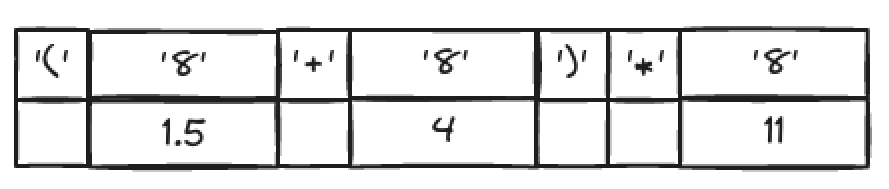
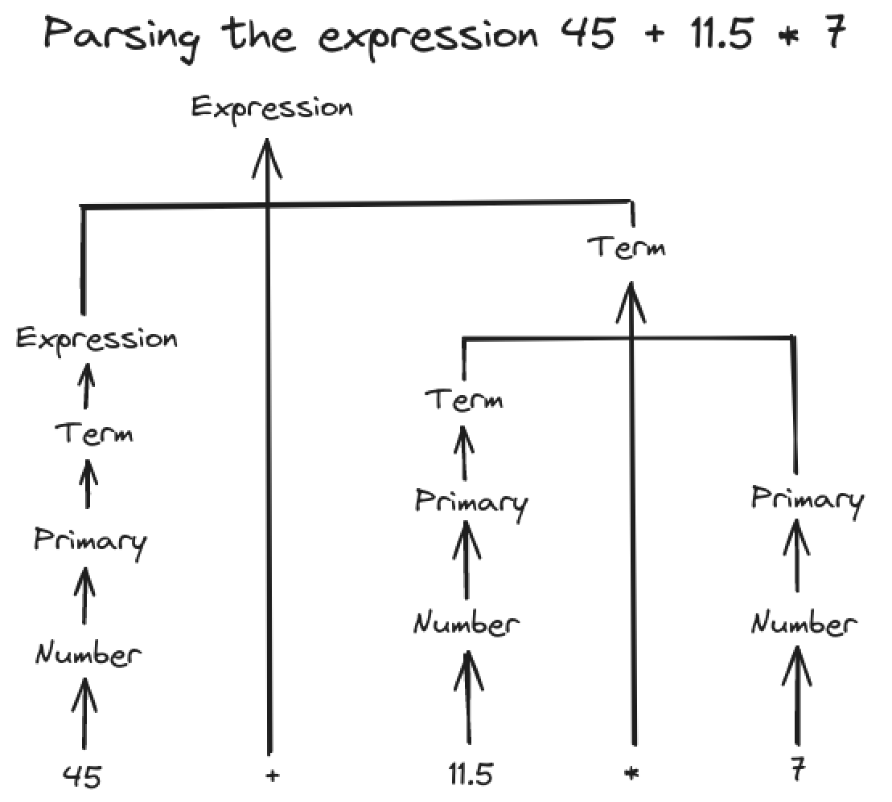
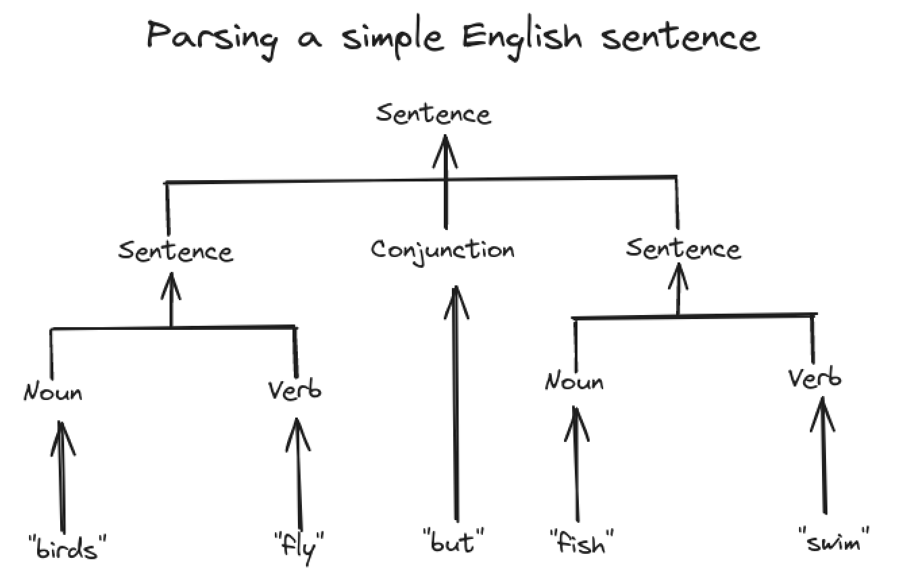

# Writing a Program

> "Programming is understanding." - Kristen Nygaard

Writing a program involves gradually refining your ideas:

- vague ideas
- analysis
- design
- implementation
- testing
- redesign
- re-implementation

## A problem

Understanding the problem is key to a good program that simply and cleanly solves the problem we decided to solve.

We chose to write simple calculator:

```console
> 2+3.1*4
14.4
```

## Thinking about the problem

So how do we start?

- Think a bit about the problem and how to solve it.
- What the program should do.
- How you'd like to interact with it.
- How the program could be written to do that.
- Write down a brief sketch of an idea for a solution.
- Discuss the problem and how to solve it.

### Stages of development

As you work on a problem you repeatedly go through these stages:

- *Analysis:* Figure out what should be done and write a *set of requirements* or a *specification*.
- *Design:* Create an overall structure for the system, deciding which parts the implementation should have and how those parts should communicate.
- *Implementation:* Write the code, debug it, and test that it actually does what is is supposed to.

### Strategy

- What is the problem to be solved? Describe the problem. Take the user's point of view.
  - Is the problem statement clear? Clarify it. Avoid requirements to be too ambitions.
  - Does the problem seem manageable, given the time, skills, and tools available? If not, ask for more resources, of simplify the task.
- Try breaking the program into manageable parts.
  - Do you know of any tools, libraries, etc. that might help? There is little value in reinventing the wheel when you are building software for real use.
  - Look for the parts of a solution that can be separately described. Designing and implementing such part is a major theme of software development (user-defined types, class hierarchies, and generic types).
- Build a small, limited version of the program (a *prototype*) that solves a key part of the problem:
  - To get solid understanding through problem analysis and experimentation.
  - To bring out problems in our understanding, ideas, and tools.
  - To see if details of the problem statement need changing to make the problem manageable. Take advantage of the feedback (writing code -> testing).
- Build a full-scale solution, ideally by using parts of the initial version.

Do not proceed with a mess; messes just grow with time.

## Back to the calculator

Sketching out examples of use early on is important. They provide a very practical definition of what the program should minimally do. For example:

```console
Expression: 2+2*3
Result: 8
```

We can come up first with the following *pseudo code*:

```c++
read_a_line
calculate // do the work
wrtie_result
```

### First attempt

```c++
#include "std_lib_facilities.h"

int main()
{
    cout << "Please enter expression (we can handle + and -): ";
    int lval = 0;
    int rval;
    char op;
    int res;
    cin>>lval>>op>>rval;  // read something like 1 + 3

    if (op=='+')
        res = lval + rval;  // addition
    else if (op=='-')
        res = lval - rval;  // subtraction

    cout << "Result: " << res << '\n';

    return 0;
}
```

Let's

1. Clean up the code a bit
2. Add multiplication and division
3. Add the ability to handle more than one operand (e.g. 1+2+3)

We should always check that our input is reasonable. Also testing a value against many constants is best done by a `switch` than an `if`-statement.

```c++
#include "std_lib_facilities.h"

int main()
{
    cout << "Please enter expression (we can handle +,-, * and /)\n";
    cout << "add an x to the end of expression (e.g. 1+2*3x): ";
    int lval = 0;
    int rval;
    cin>>lval;  // read leftmost operand
    if (!cin) error("no first operand");
    for (char op; cin>>op;) {  // read operator and right-hand operand
                               // repeatedly
        if (op!='x') cin>>rval;
        if (!cin) error("no second operand");
        switch(op) {
        case '+':
            lval += rval;
            break;
        case '-':
            lval -= rval;
            break;
        case '*':
            lval *= rval;
            break;
        case '/':
            lval /= rval;
            break;
        default:    // not another operator: print result
            cout << "Result: " << lval << '\n';
            return 0;
        }
    }
    error("bad expression");
}
```

The problem of this implementation is that it ignores conventional operator precedence. For example, `1+2*3` gives `9`, and not the expected `7`.

### Tokens

So (somehow), we have to "look ahead" on the line to see if there is a `*` (or a `/`). If so, we have to (somehow) adjust the evaluation order from the simple left-to-right order.

There is a conventional way of reading "stuff" from input and storing it - "tokenize": first input characters are read and assembled into *tokens*.

A *token* is a sequence of characters that represents something we consider a unit, such as a number or an operator.

We see the need for three kinds of tokens:

- Floating-point literals
- Operators: e.g., +, -
- Parentheses: (, )

The conventional solution is to represent each token as s (*kind*,*value*) pair. The *kind* tells us if a token is a number, an operator, or a parenthesis. For a number, we use its numerical value as its *value*.

We define a type `Token` to represent tokens. C++ is letting us define our own types (*user-defined types*) when we  need them.

### Implementing tokens

One of the way to represent tokens


in C++ is

```c++
class Token { 
public:
    char kind;
    double value;
};
```

A `Token` is a type (like `int` or `char`), so it can be used to define variables and hold values. It has two parts (called *members*): `kind` and `value`. The keyword `class` means "user-defined type"; it indicates that a type with zero or more members is being defined.

We use the member access notation, *object_name . member_name*, to access a member.

```c++
Token t;
t.kind = '+';
Token t2;
t2.kind = '8';  // we use the digit 8 as the 'kind' for numbers
t2.value = 3.14;
```

Given `Token`, we can represent the expression `(1.5+4)*11` using seven tokens like this:o



Note, that for simple tokens, like '+', we don't need the value, so we don't use its `value` member.

A user-defined type can have member functions (operations) as well as data members.

We provided two member functions to give us a more convenient way of initializing `Token`s. 

We can now initialize ("construct") `Token` objects:

```c++
Token t1 {'+'};
Token t2 {'8', 11.5};
```

### Using tokens

We can read input into a `vector` of `Token`s:

```c++
Token get_token();  // function to read a token from cin

vector<Token> tok;  // we'll put the tokens here

int main()
{
    while (cin) {
        Token t = get_token();
        tok.push_back(t);
    }
    // ..
}
```

It is still unclear how to evaluate expression after reading all of the tokens. Left-to-right evaluation is not working.

First tries to code the problem are important in understanding of the problem and can reveal some useful stuff, like notion of a token in the example. However we should do very little programming before we have done at least a bit of analysis (understanding the problem) and design (deciding on an overall structure of a solution).

### Back to the drawing board

We would like to be able to compute several expressions in a single invocation of our program; so our pseudo code grows to

```c++
while (not_finished) {
    read_a_line
    claculate    // do the work
    write_result
}
```

It is important to avoid "feature creep" early in a project (like adding support of variables into our simple calculator). Instead, always first build a simple version, implementing the essential features only. Once you have something running, you can get more ambitious. It is far easier to build program in stages that all at once. Once we start adding "neat features" it is hard to stop.

So how could we read, store, and evaluate expressions? Obviously, tokenizing is part of the solution, but only part.

## Grammars

There is a standard answer to the question of how to make sense of expressions: first input characters are read and assembled into tokens.

After tokens have been produced, the program must ensure that complete expressions are understood correctly. The standard answer is that we write a *grammar* defining the syntax of our input and then write a program that implements the rules of that grammar. For example:

```c++
// a simple expression grammar:
Expression:
    Term
    Expression "+" Term  // addition
    Expression "-" Term  // subtraction
Term:
    Primary
    Term "*" Primary     // multiplication
    Term "/" Primary     // division
    Term "%" Primary     // reminder (modulo)
Primary:
    Number
    "(" Expression ")"   // grouping
Number:
    floating-pont-literal
```

This is a set of simple rules.

- An `Expression` must be a `Term` or end with a `Term`, which must be a `Primary` or end with a `Primary`, and a `Primary` must start with a `(` or be a `Number`. A `Number` must be a `floating-point-literal`. 
- If `Primary` isn't preceded by a `/`, `*`, or `%`, then it is a complete `Term`.
- If `Term` isn't preceded by a `+` or `-`, then it is a complete `Expression`.
- If `Expression` is followed by a `+` or `-`, then it is the end of the first part of an `Expression` and we must look for the `Term` after `+` or `-`.
- If `Term` is followed by a `*`, `/`, or `%`, then we need to look for a `Primary` to finish `Term*(/,%)Primary` rule.

From our first tentative pseudo code to this approach, sing tokens and a grammar is actually a huge conceptual jump. This usually can only be done with the help of experience, literature, or Mentors.

To articulate an explanation in sufficient detail and precisely enough for a computer to understand, we need a notation - and a grammar is a most powerful and conventional tool for that.

How do you read a grammar? Basically, given some input, you start with the "top rule", `Expression`, and search through the rules to find a match for the tokens as they are read. Reading a stream of tokens according to a grammar is called *parsing*, and a program that does that is often called a *parser* or a *syntax analyzer*. Our parser reads the tokens from left to right, just like we type them and read them.



This represents the path we followed through the definitions. Note how the `Term*Primary` rule ensures that `11.5` is multiplied by `7` rather than added to `45`.

###  A detour: English grammar

Look at the following grammar for a very small subset of English:

```
Sentence:
    Noun Verb                      // e.g., C++ rules
    Sentence Conjunction Sentence  // e.g., Birds fly but fish swim
Conjunction:
    "and"
    "or"
    "but"
Noun:
    "bird"
    "fish"
    "C++"
Verb:
    "rules"
    "fly"
    "swim"
```

A sentence is built from parts of speech.



### Writing a grammar

Writing a simple grammar is pretty straightforward: we need to know how to:

1. Distinguish a rule from a token
2. Put one rule after another (*sequencing*)
3. Express alternative patterns (*alternation*)
4. Express a repeating pattern (*repetition*)
5. Recognize the grammar rule to start with

Our convention is put tokens in (double) quotes and start with the first rule. Alternatives are put on separate lines: For example:

```
List
    "{" Sequence "}"
Sequence:
    Element
    Element "," Sequence
Element:
    "A"
    "B"
```

The `List` examples are:

```
{ A }
{ B }
{ A,B }
{ A,A,A,A,B }
```

## Turning a grammar into code

We'll use the simplest method to implement grammar: we simply write one function for each grammar rule and use our `Token` to represent tokens.

### Implementing grammar rules

To implement our calculator, we need four functions: one to read tokens plus one for each rule in our grammar:

```c++
get_token()  // read characters and compose tokens
             // uses cin
expression() // deal with + and -
             // calls term() and get_token()
term()       // deal with *, /, and %
             // calls primary() and get_token()
primary()    // deal with number and parentheses 
             // calls expression() and get_token()
```

Note: Each function deals with a specific part of an expression and leaves everything else to other functions; this radically simplifies each function.

Each function should call also call other grammar functions according to the grammar rule it is implementing and `get_token()` where token is required in a rule.

Parsing functions shall return evaluated value, so we simply evaluate expression as we read it from input.

```c++
// functions to match the grammar rules:
Token get_token()   // read characters and compose tokens
double expression() // deal with + and -
double term()       // deal with *, /, and %
double primary()    // deal with number and parentheses 
```

### Expressions

Grammar is as follows:

```
Expression:
    Term
    Expression "+" Term
    Expression "-" Term
```

Since we new to this, we'll have a couple of false starts.

Note that reading code is a useful skill to cultivate.

#### Expressions: first try

As written in rule we try first calling `expression()`, then looking for `+`/`-` and then `term()`:

```c++
double expression()
{
    double left = expression(); // read and evaluate an Expression
    Token t = get_token();      // get next token
    switch (t.kind) {
    case '+':
        return left + term();   // read and evaluate a Term,
                                // then do an add
    case '-':
        return left - term();   // read and evaluate a Term,
                                // then do a subtraction
    default:
        return left;            // return the value of the Expression
    }
}
```

It is almost a trivial transcription of the grammar.

Unfortunately, that doesn't really make sense:

- Our program reads left to right and can't peek ahead to see of a `+` is coming. So we don't know where the expression ends.
- This program is an example of an *infinite recursion*, it'll call `expression() "forever".

The term *recursion* is used to describe what happens when a function calls itself.
