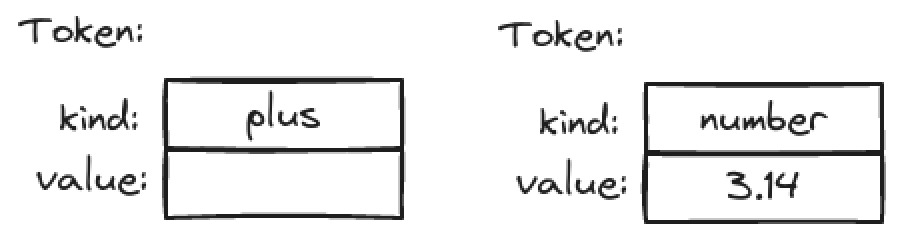

# Writing a Program

> "Programming is understanding." - Kristen Nygaard

Writing a program involves gradually refining your ideas:

- vague ideas
- analysis
- design
- implementation
- testing
- redesign
- re-implementation

## A problem

Understanding the problem is key to a good program that simply and cleanly solves the problem we decided to solve.

We chose to write simple calculator:

```console
> 2+3.1*4
14.4
```

## Thinking about the problem

So how do we start?

- Think a bit about the problem and how to solve it.
- What the program should do.
- How you'd like to interact with it.
- How the program could be written to do that.
- Write down a brief sketch of an idea for a solution.
- Discuss the problem and how to solve it.

### Stages of development

As you work on a problem you repeatedly go through these stages:

- *Analysis:* Figure out what should be done and write a *set of requirements* or a *specification*.
- *Design:* Create an overall structure for the system, deciding which parts the implementation should have and how those parts should communicate.
- *Implementation:* Write the code, debug it, and test that it actually does what is is supposed to.

### Strategy

- What is the problem to be solved? Describe the problem. Take the user's point of view.
  - Is the problem statement clear? Clarify it. Avoid requirements to be too ambitions.
  - Does the problem seem manageable, given the time, skills, and tools available? If not, ask for more resources, of simplify the task.
- Try breaking the program into manageable parts.
  - Do you know of any tools, libraries, etc. that might help? There is little value in reinventing the wheel when you are building software for real use.
  - Look for the parts of a solution that can be separately described. Designing and implementing such part is a major theme of software development (user-defined types, class hierarchies, and generic types).
- Build a small, limited version of the program (a *prototype*) that solves a key part of the problem:
  - To get solid understanding through problem analysis and experimentation.
  - To bring out problems in our understanding, ideas, and tools.
  - To see if details of the problem statement need changing to make the problem manageable. Take advantage of the feedback (writing code -> testing).
- Build a full-scale solution, ideally by using parts of the initial version.

Do not proceed with a mess; messes just grow with time.

## Back to the calculator

Sketching out examples of use early on is important. They provide a very practical definition of what the program should minimally do. For example:

```console
Expression: 2+2*3
Result: 8
```

We can come up first with the following *pseudo code*:

```c++
read_a_line
calculate // do the work
wrtie_result
```

### First attempt

```c++
#include "std_lib_facilities.h"

int main()
{
    cout << "Please enter expression (we can handle + and -): ";
    int lval = 0;
    int rval;
    char op;
    int res;
    cin>>lval>>op>>rval;  // read something like 1 + 3

    if (op=='+')
        res = lval + rval;  // addition
    else if (op=='-')
        res = lval - rval;  // subtraction

    cout << "Result: " << res << '\n';

    return 0;
}
```

Let's

1. Clean up the code a bit
2. Add multiplication and division
3. Add the ability to handle more than one operand (e.g. 1+2+3)

We should always check that our input is reasonable. Also testing a value against many constants is best done by a `switch` than an `if`-statement.

```c++
#include "std_lib_facilities.h"

int main()
{
    cout << "Please enter expression (we can handle +,-, * and /)\n";
    cout << "add an x to the end of expression (e.g. 1+2*3x): ";
    int lval = 0;
    int rval;
    cin>>lval;  // read leftmost operand
    if (!cin) error("no first operand");
    for (char op; cin>>op;) {  // read operator and right-hand operand
                               // repeatedly
        if (op!='x') cin>>rval;
        if (!cin) error("no second operand");
        switch(op) {
        case '+':
            lval += rval;
            break;
        case '-':
            lval -= rval;
            break;
        case '*':
            lval *= rval;
            break;
        case '/':
            lval /= rval;
            break;
        default:    // not another operator: print result
            cout << "Result: " << lval << '\n';
            return 0;
        }
    }
    error("bad expression");
}
```

The problem of this implementation is that it ignores conventional operator precedence. For example, `1+2*3` gives `9`, and not the expected `7`.

### Tokens

So (somehow), we have to "look ahead" on the line to see if there is a `*` (or a `/`). If so, we have to (somehow) adjust the evaluation order from the simple left-to-right order.

There is a conventional way of reading "stuff" from input and storing it - "tokenize": first input characters are read and assembled into *tokens*.

A *token* is a sequence of characters that represents something we consider a unit, such as a number or an operator.

We see the need for three kinds of tokens:

- Floating-point literals
- Operators: e.g., +, -
- Parentheses: (, )

The conventional solution is to represent each token as s (*kind*,*value*) pair. The *kind* tells us if a token is a number, an operator, or a parenthesis. For a number, we use its numerical value as its *value*.

We define a type `Token` to represent tokens. C++ is letting us define our own types (*user-defined types*) when we  need them.

### Implementing tokens

One of the way to represent tokens



in C++ is

```c++
class Token { 
public:
    char kind;
    double value;
};
```

A `Token` is a type (like `int` or `char`), so it can be used to define variables and hold values. It has two parts (called *members*): `kind` and `value`. The keyword `class` means "user-defined type"; it indicates that a type with zero or more members is being defined.

We use the member access notation, *object_name . member_name*, to access a member.

```c++
Token t;
t.kind = '+';
Token t2;
t2.kind = '8';  // we use the digit 8 as the 'kind' for numbers
t2.value = 3.14;
```

Given `Token`, we can represent the expression `(1.5+4)*11` using seven tokens like this:o


Note, that for simple tokens, like '+', we don't need the value, so we don't use its `value` member.

A user-defined type can have member functions (operations) as well as data members.

We provided two member functions to give us a more convenient way of initializing `Token`s:

We can now initialize ("construct") `Token` objects:

```c++
Token t1 {'+'};
Token t2 {'8', 11.5};
```

### Using tokens
