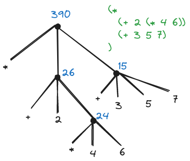

# Building Abstractions with Procedures 

- [Programming in Lisp](#programming-in-lisp)
- [The elements of programming](#the-elements-of-programming)
  - [Expressions](#expressions)
  - [Naming and the Environment](#naming-and-the-environment)
  - [Evaluating combinations](#evaluating-combinations)
  - [Compound procedure](#compound-procedure)
  - [The Substitution Model for Procedure Application](#the-substitution-model-for-procedure-application)


> The act of mind dealing with simple ideas
> 1. **Complex idea:** combining several simple ideas into one compound one.
> 2. **Relations:** view two ideas (simple or complex) at once, without uniting them.
> 3. **Abstraction:** separating ideas from all other ideas that accompany them in real existence.

*A computational process* is an abstract being that manipulate other abstract things called *data* as it evolves.

*A program* is s pattern of rules that direct the evolution of a process.

The programs we use to conjure processes are like a sorcerer's spells. They are carefully composed from symbolic expressions in arcane and esoteric *programming languages* that prescribe the tasks we want our processes to perform.

Well designed computational system are designed in a modular manner, so that the parts can be constructed, replaced, and debugged separately.

## Programming in Lisp

Lisp (acronym for "list processing") was invented in the late 1950s as a formalism for reasoning about the use of *recursion equations*, as a model for computation.

A List *interpreter* is a machine that carries out processes described in the List language.

*Scheme* is one of the dialects of the Lisp.

Lisp is a language of choice for OS shell languages and for extension languages for editors.

The most significant of the language features is the fact that Lisp descriptions of processes, called *procedures*, can themselves be represented and manipulated as Lisp data.

## The elements of programming

When we describe a language, we should pay particular attention to the means that the language provides for combining simple ideas to form more complex ideas:

- **primitive expressions:** the simplest language entities
- **means of combination:** create compound elements from simpler ones
- **means of abstraction:** name compound elements and manipulate them as units

Any powerful programming language should be able to describe primitive data and primitive procedures and should have methods for combining and abstracting procedures and data.

### Expressions

You can type an *expression* to the interpreter in the terminal, and the interpreter responds by displaying the result of its *evaluating* that expression.

Compound expression:
```lisp
(+ 137 349)
486
```

*Combinations* are expressions formed by delimiting a list of expressions within parentheses in order to denote procedure application: `(operator operands...)`. The value of a combination is obtained by applying the procedure specified by the operator to the *arguments* that are values of the operands.

Lisp uses *prefix notation*, the convention of placing the operator to the left of the operands. This approach has several advantages:

- arbitrary number of arguments: `(+ 21 35 12 7)`
- allow combinations to be *nested*: `(+ (* 3 5) (- 10 6))` 

Lisp interpreter runs in a *read-eval-print loop*.

### Naming and the Environment

Using names to refer to computational objects is a critical aspect of a language. The name identifies a *variable* whose *value* is the object.

We name things with `define`, the language's simplest means of abstraction.

```lisp
(define pi 3.14159)
(define radius 10)
(define circumference (* 2 pi radius))
circumference
62.8318
```

Complex programs are constructed by building, step by step, computational object of increased complexity. Name-object associations can be created incrementally in successive interactions.

*Environment* (*global environment*) is the memory maintained by interpreter that keeps track of the name-object pairs.

### Evaluating combinations

Procedure for evaluating combinations:

1. Evaluate the subexpressions of the combination.
2. Apply the procedure that is the value of the leftmost subexpression (the operator) to the arguments that are the values of the other subexpressions (the operands).

This evaluation rule is *recursive* in nature.

We can represent the evaluation of combinations in the form of a tree:

- nodes: combinations
- branches: the operator and the operands
- terminal nodes: either operators or numbers



Recursion is a powerful technique for dealing with *hierarchical*, *treelike* objects. In fact, the "percolate values upward starting form the terminal nodes" form of the evaluation rule is an example of a general kind of process known as *tree accumulation*.

Evaluation rule for primitive expressions:

- the values of numerals are the numbers that they name
- the values of build-in operators are the machine instruction sequences
- the values of other names are the objects associated with those names in the environment

Environment is providing a *context* in which evaluation takes play by determining the meaning of the symbols in expressions (including built-in operators' symbols).

There are *special forms* that have own evaluation rules.

In example, the special form  `define` in 

```lisp
(define x 3)
```

associates x with a value 3, this is not a combination.

The various kinds of expressions (each with its associated evaluation rule) constitute the syntax of the programming language.

### Compound procedure

*Procedure definitions* are more powerful abstraction technique comparing to primitive data and procedures, nesting using combinations, and associating names with values, by which a compound operation can be give a name and then referred to as *a unit*.

Example of the *compound procedure* with name `square` that represents the operation of multiplying something, that have a local name x, by itself.

```lisp
(define (square x) (* x x))

(square (+ 2 5))
49
```

The general form of a procedure definition is

```
(define (<name> <formal parameters>) <body>)
```

- `<name>`: a symbol to be associated with the procedure definition in the environment
- `<formal parameters>`: the names used within the body of the procedure to refer to the corresponding arguments of the procedure
- `<body>`: an expression that will yield the value of the procedure application

You can use compound procedures as a building block in defining other procedures:

```lisp
(define (sum-of-squares x y)
  (+ (square x) (square y)))

(sum-of-squares 3 4)
25
```

Compound procedures are used exactly the same way as primitive procedures.

### The Substitution Model for Procedure Application

To evaluate a combination whose operator names a compound procedure, the interpreter:

- evaluates the elements of the combinations, and 
- applies the procedure (which is the value of the operator of the combination) to the arguments  (which are the values of the operands of the combination)

The application process is as follows:

- To apply a compound procedure to arguments, evaluate the body of the procedure with each formal parameter replaced by the corresponding argument.

```lisp
(define (f a) (sum-of-squares (+ a 1) (* a 2)))
(f 5)
(sum-of-squares (+ 5 1) (* 5 2))
(+ (suqare 6) (square 10))
(+ (* 6 6) (* 10 10))
(+ 36 100)
136
```

The process is called the *substitution model* for procedure application. The purpose of the substitution is to help us think about procedure application, not to provide a description of how the interpreter really works.

In general, when modeling phenomena is science or engineering, we begin with simplified, incomplete models. As we examine things in greater detail, these simple models become inadequate and must be replaced by more refined models. The substitution model is no exception.

#### Applicative order versus normal order

- *applicative-order evaluation*: "evaluate the arguments and then apply", the interpreter first evaluates the operator and operands and then applies the resulting procedure to the resulting arguments. This method the interpreter is actually uses.
- *normal-order evaluation*: "fully expand and then reduce", it would first substitute operand expressions for the parameters until it obtained an expression involving only primitive operators, and would then perform the evaluation.

Example of normal-order evaluation:

```lisp
(f 5)
;; expansions
(sum-of-squares (+ 5 1) (* 5 2))
(+ (square (+ 5 1)) (square (* 5 2)))
(+ (* (+ 5 1) (+ 5 1)) (* (* 5 2) (* 5 2)))\
;; reductions
(+ (* 6 6) (* 10 10))
(+ 36 100)
136
```

Note that some evaluations preformed twice here.

Lisp uses applicative-order evaluations because:

- it gives additional efficiency obtained from avoiding multiple evaluation of expressions
- more significantly, normal-order evaluation becomes much complicated to deal with when we leave the realm of procedures that can be modeled by substitution

### Conditional expressions and predicates

A *case analysis* is a construct that can make tests and perform different operations depending on the result of a test.

In Lisp there is a special form for case analysis notation - `cond` (stands for "conditional").

```lisp
(define (abs x)
  (cond ((> x 0) x)
        ((= x 0) 0)
        ((< x 0) (- x))))
```

The general form of a conditional expression is

```
(cond (<p1> <e1>)
      (<p2> <e2>)
      ...
      (<pn> <en>))
```

Parenthesized pairs of expressions `(<p> <e>)` called *clauses*.

`<p>` is a *predicate* - that is,  an expression whose value is interpreted as either true or false.
