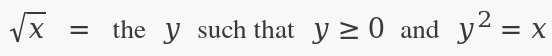
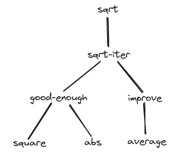

# The elements of programming

- [Expressions](#expressions)
- [Naming and the Environment](#naming-and-the-environment)
- [Evaluating combinations](#evaluating-combinations)
- [Compound procedure](#compound-procedure)
- [The Substitution Model for Procedure Application](#the-substitution-model-for-procedure-application)

When we describe a language, we should pay particular attention to the means that the language provides for combining simple ideas to form more complex ideas:

- **primitive expressions:** the simplest language entities
- **means of combination:** create compound elements from simpler ones
- **means of abstraction:** name compound elements and manipulate them as units

Any powerful programming language should be able to describe primitive data and primitive procedures and should have methods for combining and abstracting procedures and data.

## Expressions

You can type an *expression* to the interpreter in the terminal, and the interpreter responds by displaying the result of its *evaluating* that expression.

Compound expression:
```lisp
(+ 137 349)
486
```

*Combinations* are expressions formed by delimiting a list of expressions within parentheses in order to denote procedure application: `(operator operands...)`. The value of a combination is obtained by applying the procedure specified by the operator to the *arguments* that are values of the operands.

Lisp uses *prefix notation*, the convention of placing the operator to the left of the operands. This approach has several advantages:

- arbitrary number of arguments: `(+ 21 35 12 7)`
- allow combinations to be *nested*: `(+ (* 3 5) (- 10 6))` 

Lisp interpreter runs in a *read-eval-print loop*.

## Naming and the Environment

Using names to refer to computational objects is a critical aspect of a language. The name identifies a *variable* whose *value* is the object.

We name things with `define`, the language's simplest means of abstraction.

```lisp
(define pi 3.14159)
(define radius 10)
(define circumference (* 2 pi radius))
circumference
62.8318
```

Complex programs are constructed by building, step by step, computational object of increased complexity. Name-object associations can be created incrementally in successive interactions.

*Environment* (*global environment*) is the memory maintained by interpreter that keeps track of the name-object pairs.

## Evaluating combinations

Procedure for evaluating combinations:

1. Evaluate the subexpressions of the combination.
2. Apply the procedure that is the value of the leftmost subexpression (the operator) to the arguments that are the values of the other subexpressions (the operands).

This evaluation rule is *recursive* in nature.

We can represent the evaluation of combinations in the form of a tree:

- nodes: combinations
- branches: the operator and the operands
- terminal nodes: either operators or numbers


Recursion is a powerful technique for dealing with *hierarchical*, *treelike* objects. In fact, the "percolate values upward starting form the terminal nodes" form of the evaluation rule is an example of a general kind of process known as *tree accumulation*.

Evaluation rule for primitive expressions:

- the values of numerals are the numbers that they name
- the values of build-in operators are the machine instruction sequences
- the values of other names are the objects associated with those names in the environment

Environment is providing a *context* in which evaluation takes play by determining the meaning of the symbols in expressions (including built-in operators' symbols).

There are *special forms* that have own evaluation rules.

In example, the special form  `define` in 

```lisp
(define x 3)
```

associates x with a value 3, this is not a combination.

The various kinds of expressions (each with its associated evaluation rule) constitute the syntax of the programming language.

## Compound procedure

*Procedure definitions* are more powerful abstraction technique comparing to primitive data and procedures, nesting using combinations, and associating names with values, by which a compound operation can be give a name and then referred to as *a unit*.

Example of the *compound procedure* with name `square` that represents the operation of multiplying something, that have a local name x, by itself.

```lisp
(define (square x) (* x x))

(square (+ 2 5))
49
```

The general form of a procedure definition is

```
(define (<name> <formal parameters>) <body>)
```

- `<name>`: a symbol to be associated with the procedure definition in the environment
- `<formal parameters>`: the names used within the body of the procedure to refer to the corresponding arguments of the procedure
- `<body>`: an expression that will yield the value of the procedure application

You can use compound procedures as a building block in defining other procedures:

```lisp
(define (sum-of-squares x y)
  (+ (square x) (square y)))

(sum-of-squares 3 4)
25
```

Compound procedures are used exactly the same way as primitive procedures.

## The Substitution Model for Procedure Application

To evaluate a combination whose operator names a compound procedure, the interpreter:

- evaluates the elements of the combinations, and 
- applies the procedure (which is the value of the operator of the combination) to the arguments  (which are the values of the operands of the combination)

The application process is as follows:

- To apply a compound procedure to arguments, evaluate the body of the procedure with each formal parameter replaced by the corresponding argument.

```lisp
(define (f a) (sum-of-squares (+ a 1) (* a 2)))
(f 5)
(sum-of-squares (+ 5 1) (* 5 2))
(+ (suqare 6) (square 10))
(+ (* 6 6) (* 10 10))
(+ 36 100)
136
```

The process is called the *substitution model* for procedure application. The purpose of the substitution is to help us think about procedure application, not to provide a description of how the interpreter really works.

In general, when modeling phenomena is science or engineering, we begin with simplified, incomplete models. As we examine things in greater detail, these simple models become inadequate and must be replaced by more refined models. The substitution model is no exception.

### Applicative order versus normal order

- *applicative-order evaluation*: "evaluate the arguments and then apply", the interpreter first evaluates the operator and operands and then applies the resulting procedure to the resulting arguments. This method the interpreter is actually uses.
- *normal-order evaluation*: "fully expand and then reduce", it would first substitute operand expressions for the parameters until it obtained an expression involving only primitive operators, and would then perform the evaluation.

Example of normal-order evaluation:

```lisp
(f 5)
;; expansions
(sum-of-squares (+ 5 1) (* 5 2))
(+ (square (+ 5 1)) (square (* 5 2)))
(+ (* (+ 5 1) (+ 5 1)) (* (* 5 2) (* 5 2)))\
;; reductions
(+ (* 6 6) (* 10 10))
(+ 36 100)
136
```

Note that some evaluations preformed twice here.

Lisp uses applicative-order evaluations because:

- it gives additional efficiency obtained from avoiding multiple evaluation of expressions
- more significantly, normal-order evaluation becomes much complicated to deal with when we leave the realm of procedures that can be modeled by substitution

## Conditional expressions and predicates

A *case analysis* is a construct that can make tests and perform different operations depending on the result of a test.

In Lisp there is a special form for case analysis notation - `cond` (stands for "conditional").

```lisp
(define (abs x)
  (cond ((> x 0) x)
        ((= x 0) 0)
        ((< x 0) (- x))))
```

The general form of a conditional expression is

```
(cond (<p1> <e1>)
      (<p2> <e2>)
      ...
      (<pn> <en>))
```

Parenthesized pairs of expressions `(<p> <e>)` called *clauses*.

`<p>` is a *predicate* - that is,  an expression whose value is interpreted as either true or false.

In Scheme, there are two distinguished values that are denoted by the constants #t and #f. When the interpreter checks a predicate's value, it interprets #f as false. Any other value is treated as true.

Predicates are evaluated starting from `<p1>`. If a predicate with value true is found, the interpreter returns the value of the corresponding *consequent expression* `<e>` of the clause as the value of the conditional expression. if none of the `<p>`'s is found to be true, the value of the `cond` is undefined.

The word *predicate* is used for
- procedures that return true or false
- expressions that evaluate to true or false

Another way to write the absolute-value procedure is

```lisp
(define (abs x)
  (cond ((< x 0) (-x))
        (else x)))
```

`else` is a special symbol that can be used in place of the `<p>` in the final clause of a `cond`. This causes the `cond` to return as its value the value of the corresponding `<e>` whenever all previous clauses have been bypassed.

Another way to write the absolute-value procedure:

```lisp
(define (abs x)
  (if (< x 0)
      (- x)
      x))
```

This uses the special form `if`, a restricted type of conditional that can be used when there are precisely two cases in the case analysis.

The general form for is

```
(if <predicate> <consequent> <alternative>)
```

Please note that the `<e>` part of each `cond` clause may be a sequence of expressions. The value of the final expression in the sequence is returned as a value of the `cond`. In an `if` expressions the `<consequent>` and `<alternative>` must be single expressions.

In addition to primitive predicates such as <, =, and >, there are logical composition operations, which enable us to construct compound predicates:

- `(and <e1>...<en>)`: if all `<e>` evaluates to false, the value of last `<e>` is returned as the value of the `and` expression.
- `(or <e1>...<en>)`: if any `<e>` evaluates to true value, that value is returned as the value of the `or` expressions.
- `(not <e>)`

Notice that `and` and `or` are special forms, not procedures, because the subexpressions are not necessarily all evaluated (short-circuit). `not` is an ordinary procedure.

## Example: Square Roots by Newton's Method

There is an important difference between mathematical functions and computer procedures. Procedures must be effective.

As a case in point, consider the problem of computing square roots. We can define the square-root function as



This definition tells nothing about how to actually find the square root of a given number.

The contrast between function and procedure is a reflection of the general distinction between describing properties of things and describing how to do things, or, as it is sometimes referred to, the distinction between declarative knowledge (mathematics) and imperative knowledge (computer science).

The most common way to compute square roots is to use Newton's method of successive approximations. Whenever we have guess *y* for the value of the square root of a number *x*, we can perform a simple manipulation to get a better guess by averaging *y* and *x/y*.

Let's formalize the process:

- We start with a value for the radicand (the number whose square root we are trying to compute) and a value for the guess.
- If the guess is good enough for our purposes, we are done.
- If not, we must repeat the process with an improved guess.

```lisp
(define (sqrt-iter guess x)
  (if (good-enough? guess x)
    guess
    (sqrt-iter (improve guess x)
	       x)))

; A guess is improved by averaging it with the quotient of the radicand and the old guess
(define (improve guess x)
  (average guess (/ x guess)))

(define (average x y)
  (/ (+ x y) 2))

; The idea is to improve the answer until it is close enough
; so that its square differs from the radicand less then 
; a predetermined tolerance (here 0.001)
(define (good-enough? guess x)
  (< (abs (- (square guess) x)) 0.001))

; Entry point: we decided to start the guess from 1
(define (sqrt x)
  (sqrt-iter 1.0 x))

(sqrt 9)
;Value: 3.00009155413138
(square (sqrt 1000))
;Value: 1000.000369924366
```

`Sqrt-iter` demonstrates how iteration can be accomplished using no special constructs other than the ordinary ability to call a procedure.

## Procedures as Black-Box Abstractions

`Sqrt` is an example of a process defined by a set of mutually defined procedures. Notice that the definition of `sqrt-itet` is *recursive*; that is, the procedure is defined in terms of itself.

Observe that the problem of computing square roots breaks up naturally into a number of subproblems:



The importance of this decomposition strategy is not simply that one is dividing the program into parts. It is crucial that each procedure accomplishes an identifiable task that can be used as a module in defining other procedures. For example, we treat `square` procedure as a "black box" and not concerned with *how* it works. `square` is not quire a procedure but rather an abstraction, so-called *procedural abstraction*. At this level of abstraction, any procedure that computes  the square is equally good.

So a procedure definition should be able to suppress detail. A use should not need to know how the procedure is implemented in order to use it.

### Local names

One detail of a procedure's implementation that should not matter to the user of the procedure is the implementer's choice of names for the procedure's formal parameters.

The meaning of a procedure should be independent of the parameter names used by its author. The consequence is that the parameter names of a procedure must be local to the body of the procedure.

A formal parameter of a procedure has a very special role in the procedure definition, in that it doesn't matter what name the formal parameter has. Such a name is called a *bound variable*, and we say that the procedure definition *binds* its formal parameter.

If a variable is not bound, we say that it is *free*. The set of expressions for which a binding defines a name is called the *scope* of that name. In a procedure definition, the bound variables declared as the formal parameters of the procedure have the body  of the procedure as their scope.

If we will name local (bound) variable as a free one we will introduce a bug by *capturing* the free variable.

The meaning of a procedure is independent of the names of its bound variables, but it is not independent of the names of its free variables, however.

### Internal definitions and block structure

We have one kind of name isolation available to us so far: The formal parameters of a procedure are local to the body of the procedure.

The problem with `sqrt` program is that the only procedure that is important to users of `sqrt` is `sqrt`. The problem is especially severe in the construction of large systems by many separate programmers. We would like to localize the subprocedures, hiding them inside `sqrt`. To make this possible we allow a procedure to have internal definitions that are local to that procedure.

```lisp
(define (sqrt x)
  (define (good-enough? guess x)
    (< (abs (- (square guess) x)) 0.001))

  (define (improve guess x)
    (average guess (/ x guess)))

  (define (sqrt-iter guess x)
    (if (good-enough? guess x)
      guess
      (sqrt-iter (improve guess x)
	         x)))

  (sqrt-iter 1.0 x))
```

Such nesting of definitions, called *block structure*, is basically the right solution to the simplest name-packaging problem.

But in addition to internalizing the definitions of the auxiliary procedures, we can simplify them.
