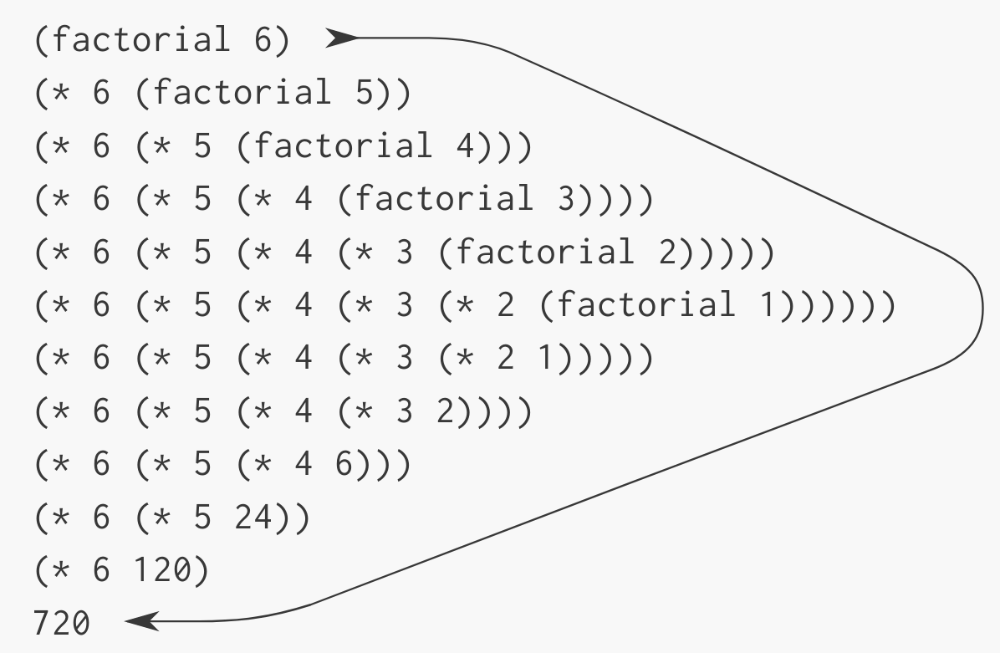
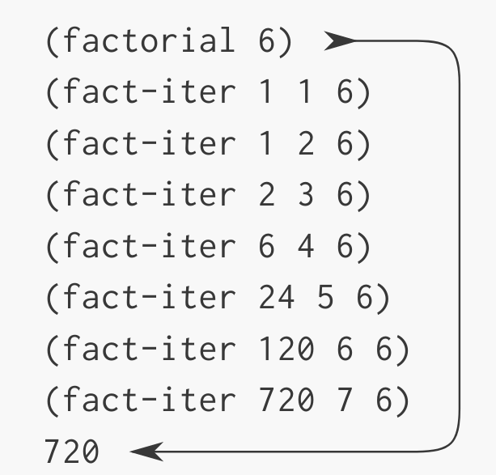

# Procedures and the Processes They Generate

We have now considered the elements of programming:

- primitive expressions
- combination of the expressions
- abstracting of the composite operations using compound procedures

But we still lack of knowledge:

- common patterns of usage
- of which procedures are worth defining
- to predict the consequences of executing a procedure

The ability to visualize the consequences of the actions under consideration is crucial to become an expert programmer.

To become experts, we must learn to visualize the processes generated by various types of procedures. Only after we have developed such a skill can we learn to reliably construct programs that exhibit the desired behavior.

A procedure is a pattern for the *local evolution* of a computational process. It specifies how each stage of the process is built upon the previous stage. We would like to be able to make statements about the overall, or *global*, behavior of a process whose local evolution has been specified by a procedure.

We will examine some common "shapes" for processes generated by simple procedures and will see how these processes consume computational resources of time and space.

## Linear Recursion and Iteration

We begin by considering the factorial function, defined by 

```
n! = n*(n - 1)*(n - 2) ... 3*2*1
```

One way to compute factorials is to make use of the observation that

```
n! = n*(n - 1)!
```

If we add stipulation that `1! = 1`, then we can translate this directly into a procedure:

```lisp
(define (factorial n)
  (if (= n 1)
    1
    (* n (factorial (- n 1)))))
```

We can use the substitution model to watch this procedure in action:



Now let's take a different perspective on computing factorials. We multiply 1 by 2, then multiply the result by 3, and so on until we reach *n*. More formally, we maintain a running product, together with a counter that counts from 1 up to *n*.

```lisp
(define (factorial n)
  (fact-iter 1 1 n))

(define (fact-iter product counter max-count)
  (if (> counter max-count)
    product
    (fact-iter (* counter product) (+ counter 1) max-count)))
```

We can use the substitution model to visualize the process of computing 6!:



Compare the two processes.

They similar in

- compute same mathematical function
- number of steps proportional to *n*
- carry out the same sequence of multiplications

But when we consider the "shapes" of the two processes, we can see that they evolve differently.

Consider the first process. We can see a shape of expansion followed by contraction.

- The expansion occurs as the process builds up a chain of *deferred operations* (chain of multiplications).
- The contraction occurs as the operations are actually performed.

This type of process, characterized by a chain of deferred operations, is called a *recursive process*. Carrying out this process requires that the interpreter keep track of the operations to be performed later on.

In the computation of *n*!, the length of the chain of deferred multiplications, and hence the amount of information needed to keep track of it, grows linearly with *n*., just like the number of steps. Such a process is called a *linear recursive process*.

By contrast, the second process does not grow and shrink. At each step, all we need to keep track of, for any *n*, are the current values of the variables `product`, `counter`, and `max-count`. We call this an *iterative process*.

In general, an iterative process is one whose state can be summarized by a fixed number of *state variables*, together with a fixed rule that describes how the state variables should be updated as the process moves from state to state and an (optional) end test that specifies conditions under which the process should terminate.

In computing *n*!, the number of steps grows linearly with *n*. Such a process is called a *linear iterative process*.

In the iterative case, the program variables provide a complete description of the state of the process at any point.

In the case of recursive process there is some additional "hidden" information, maintained by the interpreter and not contained in the program variables, which indicates "where the process is" in negotiating the chain of deferred operations. The longer the chain, the more information must be maintained.

We must not to confuse the notion of a recursive *process* with the notion of a recursive *procedure*.

- Recursive procedure: we are referring to the syntactic fact that the procedure definition refers (either directly or indirectly) to the procedure itself.
- Recursive process: are are speaking about how the process evolves.

Most implementations of common languages (including C) are designed in such a way that the interpretation of any recursive procedure consumes an amount of memory that grows with the number of procedure calls, even when the process described is, in principle, iterative. As s consequence, these languages can describe iterative process only by using special-purpose "looping constructs" such ad `for` and `while`.

The implementation of Scheme does not share this defect. It will execute an iterative process in constant space, even if the iterative process is described by a recursive procedure. An implementation with this property is called *tail-recursive*.

## Tree Recursion

Another common pattern of computation is called *tree recursion.* As an example, consider computing the sequence of Fibonacci numbers, in which each number is the sum of the preceding two.

The Fibonacci numbers can be defined by the rule


We can translate this definition into a recursive procedure:

```lisp
(define (fib n)
  (cond ((= n 0) 0)
	((= n 1) 1)
	(else (+ (fib (- n 1)) 
		 (fib (- n 2))))))
```

The tree-recursive process generated in computing (fib 5):


Notice that the branches split into two at each level (except at the bottom); this reflects the fact that the `fib` procedure calls itself twice each time it is invoked.

This process is terrible due to redundant computation.

The process uses a number of steps that grows exponentially with the input. But the space required grows only linearly with the input, because we need keep track only of which nodes are above us in the tree at any point in the computation. In general, the number of steps required by a tree-recursive process will be proportional to the number of nodes in the tree, while the space required will be proportional to the maximum depth of the tree.

We can also formulate an iterative process for computing the Fibonacci numbers. The idea is to use a pair of integers `a` and `b`, initialized to `Fib(1) = 1` and `Fib(0) = 0`, and to repeatedly apply the simultaneous transformations:

```
a <- a + b
b <- a
```

After applying this transformation `n` times, `a` and `b` will be equal, respectively, to `Fib(n+1)` and `Fib(n)`.

```lisp
(define (fib n)
  (fib-iter 1 0 n))

(define (fib-iter a b count)
  (if (= count 0)
    b
    (fib-iter (+ a b) a (- count 1))))
```

This second method for computing `Fib(n)` is a linear iteration. The number of its step is linear to `n`, but the number of steps of the first version of the procedure is growing as fast as `Fib(n)` itself. The difference is enormous.

When we consider processes that operate on hierarchically structured data rather than numbers, we will find that tree recursion is a natural and powerful tool.

To formulate the iterative algorithm required noticing that the computation could be recast as an iteration with three state variables.

A tree-recursive process may be highly inefficient but often easy to specify and understand.

## Order of Growth

Processes can differ considerably in the rates at which they consume computational resources. One convenient way to describe this difference is to use the notion of *order of growth* to obtain a gross measure of the resources required by the process as inputs become larger.
