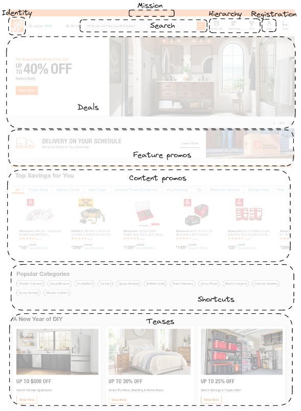

# The Big Bang Theory of Web Design

- [Home page essentials](#the-importance-of-getting-people-off-on-the-right-foot)
- [Home page constraints](#and-you-have-to-do-itblindfolded)
- [Home page shall show big picture](#the-first-casualty-of-war)
- [Home page is still important](#butthe-home-page-really)
- [Tools to convey the message](#how-to-get-the-message-across)
- [Tagline](#nothing-beats-a-good-tagline)
- [Where should I start at the Home page](#the-fifth-question)
- [The tragedy of the commons](#why-golden-geese-make-such-tempting-targets)

## The importance of getting people off on the right foot

When you think you've covered all on the Home page, there's always just *one...more...thing*.

Home page has to accommodate:

- **Site identity and mission.** Home page shall tell
  - what site this is
  - what it's for
  - why user should be here
- **Site hierarchy.** Persistent navigation of the Home page shall give site *overview*
  - its content (what can I find here?)
  - its features (what can I do here?)
  - how it's all organized
- **Search.** *Prominently* displayed search box.
- **Teases.** Hints of the "good stuff" inside.
- **Content promos.** Spotlight the newest, best, or most popular content.
- **Feature promos.** Additional sections or features to try.
- **Timely content.** Some content needs to be updated frequently.
- **Deals.** Advertising.
- **Shortcuts.** The most frequently used pieces of content (i.e. software updates).
- **Registration.** Links to log in/sign in.

Home page's objectives are:

- **Show me what I'm looking for.** Make it *obvious* to to get what user wants.
- **...and what I.m *not* looking for.** Expose offers that user *might* be interested in.
- **Show me where to start.** It's very bad if user don't know where to begin.
- **Establish credibility and trust.** You only have one chance to make a **first impression**.

## And you have to do it...blindfolded

Home page designing has to be done under adverse conditions:

- **Everybody wants a piece of it.** Things that are prominently promote on the Home page tend to get significantly greater traffic. As a result, every stakeholder wants a promo or a link to their section on the Home page.
- **Too many cooks.** Due to it's importance, it's the one page everybody (even the CEO) has an opinion about.
- **One size fits all.** The Home page has to appeal to *everyone* who visits the site.

## The first casualty of war

Designing a Home page inevitably involves compromise as you cannot add everything the Home pages has to accomplish.

The one thing you can't afford to lose in the shuffle is **conveying the big picture.** It is a common design mistake that a Home page is not clear enough *what the site is*.

As quickly and clearly as possible (and with very little effort from user), the Home page needs to answer the four questions when user enter the site first time:

- **What is this?**
- **What do they have here?**
- **What can I do here?**
- **Why should I be here - and somewhere else?**

The Big Bang Theory of Web Design is based on the idea that the first few seconds you spend on a new Web site or Web page are critical.

Experiments shown that initial impressions tended to be very similar to the impressions people had after they actually had a chance to spend time on the page, thus they tend to be a pretty reliable predictor.

If first assumptions are wrong, users can have even more misinterpretations as they dig deeper into the site.

It's crucial that you get them off on the right foot, making sure that they're clear on the big picture.

## But...the *Home* page? Really?

Compared to the early days of the Web, the Home page has lost its preeminence. Now people are teleported from a link of a search engine, or a social network directly to a page deep in your site.

This is why it's so important that every page shall try to orient them properly:

- Who you are?
- What you do?
- What you site has to offer?

Users formed new behavior: after appearing in the depths of a site, the first think they'll do is *visit the Home page* to get the answers to the mentioned questions.

## How to get the message across

Three important places for showing of what the site is about:

- **The tagline.** A phrase that's visually connected to the Site ID, a description of the whole site.
- **The Welcome blurb.** A terse description of the site, displayed in a prominent block, usually at the top left of center of the content space.
- **The "Learn more here".** People have now come to expect a short explanatory video on most sites.

Guidelines for getting the message across:

- **Use as much space as necessary.** Elements on the page shall help to reinforce what the site is about.
- **..but don't use any more space than necessary.** Keep it short - just long enough to get the point across, and no longer. Focus on the most important features only.
- **Don't use a mission statement as a Welcome blurb.** Nobody reads them.
- **It's one of the most important things to test.** You can't trust your own judgment about this. Show the page to the people outside of the organization.

## Nothing beats a good tagline!

A tagline is a pithy (concise) phrase that characterizes the whole enterprise, summing up what is is and what make it great.

Tagline appears right below, above, or next to the Site ID.

Tagline's attributes are:

- **Clear** and **informative** and explain exactly what your site or organization does.
- **Just enough, but not too long.** Six to eight words long.
- **Convey differentiation** and a clear benefit.
- **Personable, lively** and **sometimes clever**. Cleverness shall not obscure the benefit.
- Bad taglines sound **generic** (like "Here with you. Here for you.")
  Don't confuse a tagline with a motto, like "To protect and to serve". A **motto** expresses a guiding principle, a goal, or an ideal, but a tagline conveys a *value proposition*.

Even well known sites with a big audience and a strong offline brand should benefit from a tagline.

## The fifth question

`Where do I start?`

Quick look around the Home page shall reveal:

- Where to start to search
- Where to start to browse
- Where to start to get best stuff samples

The need to promote *everything* obscures these entry points.

The best way to keep this from happening is to make the entry points look like entry point (i,e, make the search box look like a search box, same for the list of sections). It also helps to label them clearly, like "Search", "Browse by Category".

## Why Golden Geese make such tempting targets

The worst of the "killing the golden goose" Home page design behaviors is the tendency to try to promote everything. This is due to promoting things on the Home page works too well.

The problem is, the rewards and the costs of adding more things to the Home page aren't shared equally.

It's a perfect example of the tragedy of the commons:

> Any shared resource (a "commons") will inevitable be destroyed by overuse.

Preserving the Home page from promotional overload requires constant vigilance, since it usually happens gradually, with the slow, inexorable (relentless) addition of just...one...more...thing.

[Home](index.md) | [Top]() | [Next](average_user.md)