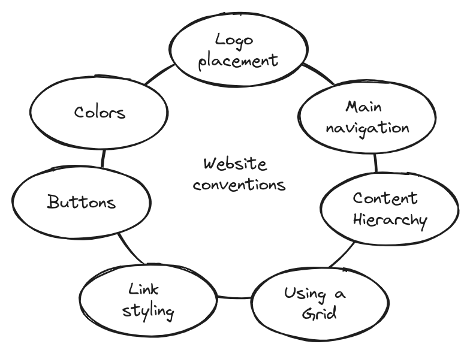

# Billboard Design 101

**Design for scanning, not reading.**

- [Take advantage of conventions](#conventions-are-your-friends)
- [Create effective visual hierarchies](#create-effective-visual-hierarchies)
- [Break pages up into clearly defined areas](#break-up-pages-into-clearly-defined-areas)
- [Make it obvious what's clickable](#make-it-obvious-whats-clickable)
- [Eliminate distractions](#keep-the-noise-down-to-a-dull-roar)
- [Format content to support scanning](#format-text-to-support-scanning)

## Conventions are your friends

Make it easier to grasp in a hurry by following the existing conventions - the widely used design patterns. Do not reinvent the wheel.

Users have expectations about:

- Where things will be located on a page.
- How things work.
- How things look.

Innovate when you *know* you have a better idea, but take advantage of conventions when you don't.

The rule of thumb is that you can - and *should* - be as creative and innovative as you want, *as long as you make sure it's still usable*.

Consistency *is always* a good thing to strive for within your site or app. But if you can make something *significantly* clearer by making it *slightly* inconsistent, choose in favor of clarity.

## Create effective visual hierarchies

Make sure that the appearance of the things on the page - all of the visual cues - accurately portray the relationships between the things on the page:

- The more important something is, the more prominent it is.
- Things that are related logically are related visually.
- Things are "nested" visually to show what's part of what.

Every newspaper page uses **prominence**, **grouping**, and **nesting** to give us information about it's content.

A good visual hierarchy saves us work by preprocessing the page for us, organizing and prioritizing its contents in a way that we can grasp almost instantly.

## Break up pages into clearly defined areas

It is important because it allows users to decide quickly which areas of the page to focus on and which areas they can safely ignore. (i.e. **banner blindness** - the ability of users to completely ignore areas they think will contain ads.)

## Make it obvious what's clickable

As we scan a page, we're looking for a variety of visual cues that identify things as clickable (or "tappable"):

- shape (buttons, tabs)
- location (menu bar)
- formatting (color and underlining)
- changing cursor shape (from an arrow to a hand, i.e., but this  is relatively slow process)

You can stick to one color for all text links or make sure that their shape and location identify them as clickable. Do not use the same color for links and nonclickable headings.

## Keep the noise down to a dull roar

One of the great enemies of easy-to-grasp pages is visual noise:

- **Shouting**. *Everything* can't be important. Shouting is usually the result of a failure to make tough decisions about which elements really the most important and then create a visual hierarchy that guides users to them first.
- **Disorganization**. Use grids to align the elements on a page.
- **Clutter**. Too much *stuff* on a page. You end up with a low signal-to-noise ratio: lots of noise, not much information, and the noise obscures the useful stuff. When creating pages assume that *everything* is a visual noise and get rid of anything that's not making a real contribution.

## Format text to support scanning

Most of the time users *are scanning* the text on the Web pages in search of something.

Make you pages scan-friendly:

- **Use plenty of headings.**
Headings act as an informal outline for a page telling what each section is about.
Make sure there's an obvious visual distinction between different levels of heading.
Don't let your headings float. Make sure they're closer to the section they introduce than to the section they follow.
- **Keep paragraphs short.**
If you examine a long paragraph, you'll almost always find that there's a reasonable place to break it in two.
- **Use bulleted lists.**
Almost anything that *can* be a bulleted list probably *should* be. Place additional space between the items for optimal readability.
- **Highlight key terms.**
Scanning consists of looking for key words and phrases. Format most important ones in a bold where they first appear in the text. Don't highlight too many things.

[Home](index.md) | [Top]() | [Next](/choices.md)
