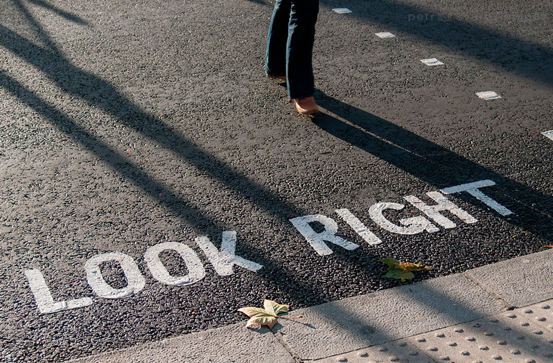

# Mindless choices

> It doesn't matter how many times I have to click,
> as long as each click is a mindless, unambiguous choice.

Users don't mind a lot of clicks as long as each link is painless and they have continued confidence that they're on the right track.

## Some assistance may be required

If choice is difficult, provide guidance:

- **Brief:** The smallest helpful information as possible.
- **Timely:** Shown up exactly when it needed.
- **Unavoidable:** Formatted to ensure it will be noticeable.

Examples are tips adjacent to form fields, "What's this?" links, tool tips.

[Home](/ux.md) | [Next](/omit_words.md)
