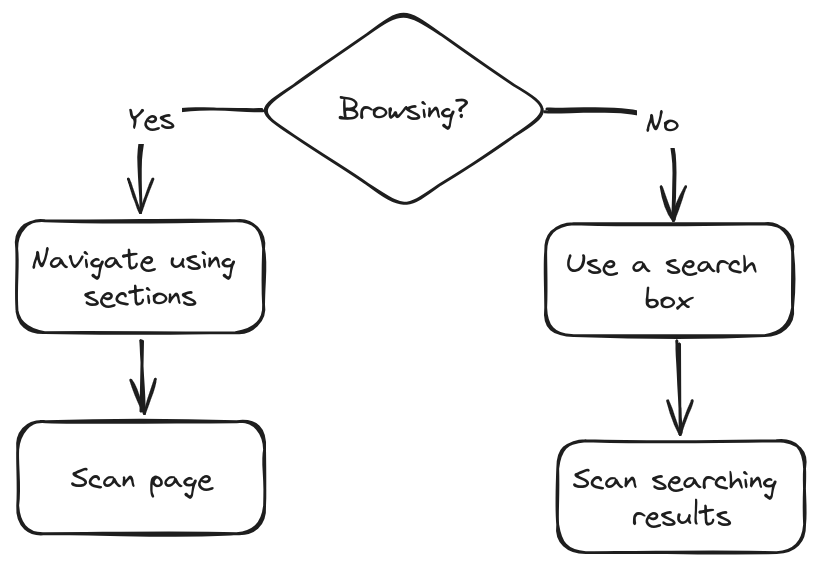
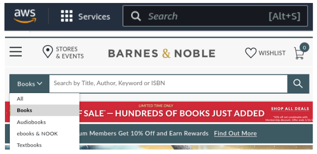
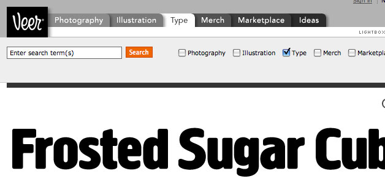

# Street signs and Breadcrumbs

**Designing navigation.**

- [Web Navigation 101](#web-navigation-101)
- [The unbearable lightness of browsing](#the-unbearable-lightness-of-browsing)
- [The overlooked purposes of navigation](#the-overlooked-purposes-of-navigation)
- [Web navigation conventions](#web-navigation-conventions)
- [Persistent navigation](#dont-look-now-but-i-think-its-following-us)
- [Navigation and Forms](#did-i-say-every-page)
- [Site ID](#now-i-know-were-not-in-kansas)
- [Sections](#the-sections)
- [Utilities](#the-utilities)
- [Link to Home page](#just-click-your-heels-three-times-and-say-theres-no-place-like-home)
- [Search](#a-way-to-search)
- [Low-level navigation](#secondary-tertiary-and-whatever-comes-after-tertiary)
- [Page names](#page-names-or-why-i-love-to-drive-in-la)
- [You are here](#you-are-here)
- [Breadcrumbs](#breadcrumbs)
- [Tabs](#three-reasons-why-i-still-love-tabs)
- [Trunk test](#try-the-trunk-test)

If you can't find what you're looking for or can't understand how the site is organized, you'll leave it quite soon.

## Web Navigation 101

Navigation
: getting from one place to another
: figuring out where you are

Navigating in web sites in many ways resembles the process of looking for stuff in the store, where you're rely on store's signs or soliciting clerk for a help.

- **You're usually trying to find something.**
- **You decide whether to ask first or browse first.** The Web equivalent of asking directions is searching using a search box. People can be divided into "search-dominant", "link-dominant", and in-between, whose behavior depends on circumstances.
- **If you choose to browse, you make your way through a hierarchy, using signs to guide you.** You can use Home page's main sections, then subsections, then individual links.
- **Eventually, if you can't find what you're looking for, you'll leave.**

## The unbearable lightness of browsing

When browsing it *feels* like we're moving around in a physical space.

Oddities of the Web space:

- **No sense of scale**. How big the Web site? Different color of the clicked links can provide some small sense of what is covered.
- **No sense of direction**. We can talk only about moving up and down in hierarchy.
- **No sense of location**.

We need to *retrace* our steps to return to something in a Web site. This is why bookmarks, the Back button and the Home page are important.

Home pages are *fixed* places that can give you a fresh start.

Web navigation compensates for missing sense of place by embodying the site's hierarchy, creating a sense of "there".

## The overlooked purposes of navigation

- **It tells us what's here.** Navigation reveals content!
- **It tells us how to use the site.** It tells you *implicitly* where to begin and what your options are.
- **It gives us confidence in the people who build it.** An opportunity to create a good impression.

## Web navigation conventions

Physical spaces (cities), or printed books have their own navigation systems, with conventions that have evolved over time, like street signs, page numbers, and chapter titles.

Conventions let us locate navigation elements quickly, with minimum of effort.

Basic navigation conventions for the Web:

- Site ID
- Utilities (Sign In, Search bar)
- Sections
- "You are here" indicator
- Page name
- Local navigation (Things at the current level)
- Footer navigation

## Don't look now, but I think it's following us

Persistent navigation (global navigation)
: the set of navigation elements that appear on **every** page of a site

It can be slightly changed from page to page, but it always here, and it always work the same way.
This can signal to user that he's still on the *same* site.

Persistent navigation includes four elements:

- Site ID
- Sections
- Utilities
- Search

## Did I say every page?

There is one exception to the statement that navigation shall be on every page: forms.

On the pages with forms the persistent navigation can introduce destruction.

For these pages there shall be a minimal version on the persistent navigation:

- Site ID
- a link to Home
- Utilities that might help with filling out the form

## Now I know we're not in Kansas

The Site ID or logo is like the building name for a Web site.

Site ID shall be at the top of the page - usually the upper left corner, so it frames the entire page. Because the Site ID represents the whole site, so it shall be at the top its logical hierarchy.

Two ways to get *primacy* across in the visual hierarchy:

- make it most prominent thing
- make it frame everything else

The Site ID also need to *look* like a Site ID:

- distinctive typeface
- a graphic that's recognizable at any sizes

## The Sections

The Sections (primary navigation)
: the links to the main sections of the site: the top level of the site's hierarchy

Some designs of the persistent navigation includes:

- space for the *secondary* navigation (list of current section's subsections)
- dropdown menu when clicking on the section name
- clicking leads to the section's front page with the secondary navigation

## The Utilities

Utilities
: the links to important elements of the site that not a part of *content*

Utilities examples:

- About Us
- Contact Us
- Sign in/Register
- Help
- Site Map
- Shopping Cart

The Utilities list should be slightly less prominent than the Sections.

As a rule, the persistent navigation can accommodate only **four of five** Utilities.

The less frequently used left overs belong in the footer.

## Just click your heels three times and say, "There's no place like home"

Most crucial item of the persistent navigation is a button or link that takes you to the Home page.

Users expect Site ID to be a link/button to the Home page. It's a good idea to include Home with the main section of the site.

## A way to search

Every page should have either a search box or a link to a search page.

The first thing a large percentage of the users will do on the site is scan for the combination of:

- a box
- a button, and
- the word "Search" or magnifying glass icon.

**Avoid** using:

- fancy wording (Quick Find, Quick Search, etc.)
- instructions (these days most of the people familiar with search)
- options (or clearly state *scope* of the search)

## Secondary, tertiary, and whatever comes after tertiary

Most common problem: failing to give the lower-level navigation the same attention as the top. The navigation for the third and other levels breaks down and becomes *ad hoc* (special).

Users spends as much time on lower-level pages as they do at the top.

You shall have well navigation design for all of the levels.

## Page names, or Why I love to drive in L.A.

L.A. has the best street signs, so you can shill while driving:

- **Street signs are big**
- **They're in the right place**

Page names are the street signs of the Web. Just as with street signs, when things are going well you may not notice page names. But in case of searching for the right direction, they become important:

- **Every page needs a name.** Highlighting page name in the navigation is no enough.
- **The name needs to be in the right place.** It shall frame page's unique content.
- **The name needs to be prominent.**  Combination of
  - size (usually it's the largest text on the page)
  - color
  - typeface
- **The name needs to match what I clicked.** It's a crucial agreement between you and user.

## You are here

A "You are here" indicator counteracts the user's "lost in space" feelings:

- highlighting location in navigation bars, lists, or menus.

The indicator shouldn't be too *subtle*. It needs to **stand out**. One way to ensure that they stand out is to apply more that one visual distinction (i.e. different color *and* bold text).

## Breadcrumbs

Like "You are here" indicators, breadcrumbs show you where you are.

Breadcrumbs show you the path from the Home page to where you are and make it easy to move back up to the higher levels in the hierarchy of a site.

Doing right, breadcrumbs are self-explanatory, take small place and provide convenient and consistent way to:

- back up a level
- go Home

Best practices:

- **Put them at the top**, so the can be seen as an accessory, like a page numbers in a book.
- **Use > between levels.**
- **Boldface the last item.** It give it the prominence the user is on that page.

## Three reasons why I *still* love tabs

Tabs are the case where using a physical metaphor in a user interface actually works.

Tabs divide whatever they're sticking out of into sections. And they make it easy to open a section by reaching for its tab (in case of the Web, clicking on it).

- **They're self-evident.**
- **They're hard to miss.** People can miss horizontal navigation, but tabs create an obvious-at-a-glance division between navigation and content.
- **They're slick.** If done correctly, tabs can add polish and serve a useful purpose.

For tabs to work to full effect, the graphics have to create the visual illusion that the active tab is in front of the other tabs.

To create this illusion, the active tab needs to be a different color or contrasting shade, and it has to physically connect with the space below it. This is what makes the active tab "pop" to the front.

## Try the trunk test

An acid test for good Web navigation.

We're tempting to think that users start from the Home page, but in reality we're often dropped down in the middel of a site from the a search engine's link an example. Just like blindfolded and locked in the trunk of a car fellow has been dropped somewhere in the deep forest.

You want to be relying solely on the overall appearance of things, not the details. This is because users usually not have enough time for close scrutiny, remember, they're *scanning* pages.

- **Step 1.** Choose a page anywhere in the site at random, and print it.
- **Step 2.** Hold it at arm's length or squint so you can;t really study it closely.
- **Step 3.** As quickly as possible, try to find and circle each of these items:
  - Site ID
  - Page name
  - Sections (Primary navigation)
  - Local navigation
  - "You are here" indicator(s)
  - Search

[Home](index.md) | [Top]() | [Next](big_bang_theory.md)
