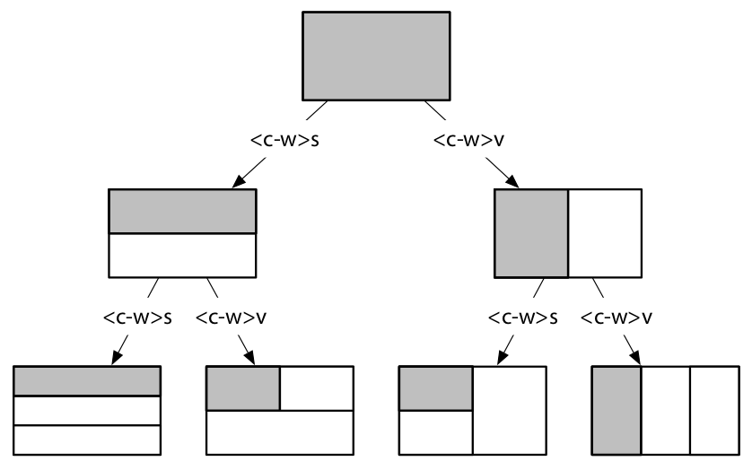

# Manage multiple files
Vim lets us work on multiple files at the same time - the buffer list lets us keep track of opened files
- `:arg` command allows us to group files into a collection
- Vim allows us to split windows

## Track open files with the buffer list

We are not editing a file. Instead, we're editing an in-memory representation of a file, which is called a *buffer*.

Files are stored on the disk, whereas buffers exist in memory. If we decide that we want to keep our changes, we can write the contents of the buffer back into the file. Most Vim commands operate on buffers, but a few operate on files, including `:write`, `:update`, and `:saveas` commands.

The `:ls` command gives us a listing of all the buffers that have been loaded into memory:

```:ls
  1 %a   "a.txt"                        line 1
  2 #    "b.txt"                        line 1
```

`%` - buffer in the current window

`a` - an active buffer; it is loaded and visible

`#` - the alternate buffer for ":e #" and CTRL-^

You can quickly toggle between the current and alternate files by pressing `<C-^>`.

| Buffer action | Command |
|----------------|-----------|
| Move backward  | `:bprev`  |
| Move forward   | `:bnext`  |  
| Jump to the start  | `:bfirst` |
| Jump to the end  | `:blast` |
| Jump to a buffer by number | `:buffer N` |
| Jump to a buffer by name | `:buffer {bufname}` |

The `:bufdo` command allows us to execute as Ex command in all of the buffers.

### Deleting buffers

You can delete a buffer by using one of these forms:

```
:bdelete N1 N2 N3  (i.e. :bd 5 6 7 8 9 10)
:N,M bdelete	   (i.e. :5,10bd)
```

Note that deleting a buffer has no effect on its associated file; it simply removes the in-memory representation.

Unless you have a good reason to delete a buffer, you can don't bother at all.

## Group buffers into a collection with the argument list

The argument list is useful for grouping together a collection of files for easy navigation.

The argument list `:arg` represents the list of files that was passed as an argument when we ran the `vim` command.
The `[]` characters indicate which of the files in the argument list is active.

### Populate the argument list

We can set the contents of the argument list using the form:

```
:args {arglist}
```

For example

```
:args index.html app.js	// explicit filenames
:args *.*		// globes
:args **/*.js **/*.css	// globes, where ** looks recursevely into directories below
:args **/*.*
:args `cat .files`	// backtick expansion (".file" can contain a filename per line)
```

We can use the argument list to group our buffers into a collection. With the `:args {arglist}` command, we can clear the list and then repopulate it from scratch.

| The argument list action | Command |
| ------------------------ | ------- |
| Move forward | `:next` |
| Move backward | `:prev` |
| Jump to the first file | `:first` |
| Jump to the last file | `:last` |
| Add file to the list | `:arga {arglist}` |
| Remove file from the list | `:argd {arglist}` |

## Divide your workspace into split windows

Vim allows us to view multiple buffers side by side by dividing our workspace into split windows.

A *window* is a viewport onto a buffer (`:h window`).

### Creating split windows



| Command | Effect |
|---------|--------|
| `<C-w>s` | Split the current window horizontally, reusing the current buffer in the new window | 
| `<C-w>v` | Split the current window vertically, reusing the current buffer in the new window | 
| `:sp[lit] {file}` | Split the current window horizontally, loading `{file}` into the new window | 
| `:vsp[lit] {file}` | Split the current window vertically, loading `{file}` into the new window | 

You can also run `:edit {filename}` to load another buffer into the active window.

### Changing the focus between windows

For the complete list see `:h window-move-cursor`.

| Command | Effect |
|---------|--------|
| `<C-w>w` | Cycle between open windows |
| `<C-w>h` | Focus on the window to the left |
| `<C-w>j` | Focus on the window below |
| `<C-w>k` | Focus on the window above |
| `<C-w>l` | Focus on the window to the right |

In fact, you can press and hold the `<Ctrl>` key, like `<C-w><C-w>`.

### Closing windows

| Ex command | Normal command | Effect |
|------------|----------------|--------|
| `:clo[se]` | `<C-w>c` | Close the active window |
| `:on[ly]` | `<C-w>o` | Keep only active window, closing all others |

### Resizing and rearranging windows

For the full list, look up `:h window-resize`.

| Keystrokes | Buffer contents |
|------------|-----------------|
| `<C-w>=` | Equalize width and height of all windows |
| `<C-w>_ `  | Maximize height of the active window |
| `<C-w>|`  | Maximize width of the active window |
| `[N]<C-w>_ `  | Set active window height to [N] rows |
| `[N]<C-w>|`  | Set active window width to [N] columns |

Resizing windows can be more convenient to do with mouse by dragging the border of the window.

## Organize you window layouts with tab pages

In Vim, a *tab page* is a container that can hold a collection of windows (`:h tabpage`).

### How to use tabs

Vim's tab pages can be used to partition work into different workspaces.

The `:lcd {path}` command lets us set the working directory locally for the current window (not tab page). If we have a tab page containing several split windows, we could set the local working directory for all of them by running `:windo lcd {path}`. 

### Opening and closing tabs

| Command | Effect |
|---------|--------|
| `:tabe[dit] {filename}` | Open `{filename}` in a new tab |
| `<C-w>T` | Move the current window into its own tab |
| `:close` | Close the window and the tab page with it |
| `:tabc[lose]` | Close the current tab page and all of its windows |
| `:tabo[nly]` | Keep the active tab page, closing all others |

### Switching between tabs

Tabs are numbered starting from 1.

| Ex command | Normal command | Effect |
|------------|----------------|--------|
| `:tabn[ext] {N}` | `{N}gt` | Switch to tab page number {N} (remember as *goto tab* {N}) |
| `:tabn[ext]` | `gt` | Switch to the next tab page |
| `:tabp[revious]` | `gT` | Switch to the previous tab page |

### Rearranging tabs

We can use the `:tabmove [N]` Ex command to rearrange tab pages.

[N] = 0 - tab page is moved to the beginning
Omit [N] - tab page is moved to the end
