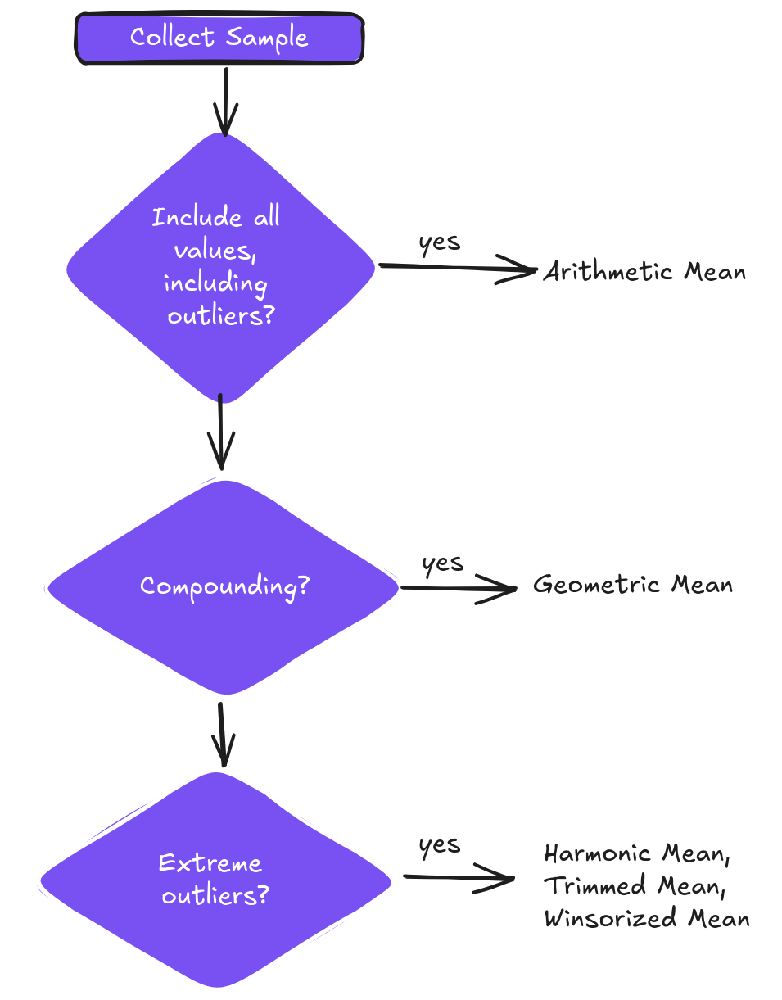

# Module 1. Rates and Returns

## Interest rates and time value of money

> interpret interest rates as required rates of return, discount rates, or opportunity costs and explain an interest rate as the sum of a real risk-free rate and premiums that compensate investors for bearing distinct types of risk

Cash received today is preferred to cash promised in the future. 

An **interest rate (or yield)**, denoted *r*, is a rate of return that reflects the relationship between differently dated - timed - cash flows.

Interest rates can be interpret as:

- *Required rates of return*, or minimum rate accepted by investor
- *Discount rates*, that determines today's equivalent of future cash amount
- *Opportunity costs*. An **opportunity cost** is the value that investors forgo by choosing a course of action. 

### Determinants of Interest Rates

Interest rates are set by the forces of supply and demand, where investors supply funds, and borrowers demand their use.

*r* = Real risk-free interest rate + Inflation premium + Default risk premium + Liquidity premium + Maturity premium. (1)

The **real risk-free interest rate** is the single-period interest rate for a completely risk-free security if no inflation were expected. It reflects the time preference of individuals for current versus future real consumption.

Nominal risk-free rate = Real risk-free rate + inflation premium.

Many countries have short-term government debt whose interest rate can be considered to represent the nominal risk-free interest rate over that time horizon in that country (i.e. a 90-day US T-bill). Please note, that typically, interest rates are quoted in *annual* terms.

## Rates of Return

> calculate and interpret different approaches to return measurement over timer and describe their appropriate uses

Financial assets are defined in terms of their return and risk characteristics.

Financial assets generate two types of return:

- periodic income (dividends or interest payments)
- capital gain or loss (price of the asset itself)

Returns can be measured over a single period or over multiple periods.

### Holding Period Return

A **holding period return**, R, is the return earned from holding an asset for a single specified period of time.

$R=\frac{(P_1-P_0)+I_1}{P_0}$, (1)

where the subscript indicates the time of the price or income; (*t*=0) is the beginning of the period; and (*t*=1) id the end of the period.

Return can be expressed in decimals (0.07), fractions (7/100), or as a percent (7 percent). They are all equivalent.

The one-year holding period return that is computed by compounding the three annual returns:

$R = [(1+R_1) \times (1+R_2) \times (1+R_3)] - 1$,

where $R_1, R_2$, and $R_3$ are the three annual returns.

Most holding period returns are reported as daily, monthly, or annual returns.

### Arithmetic or Mean Return

When assets have returns for multiple holding periods you need to normalize returns to a common period for easy of comparison and understanding. 

The arithmetic or mean return (a simple arithmetic average of the holding period returns) is denoted by $\overline{R_i}$ and given by the following equation for asset *i*, where $R_{it}$ is the return in period *t* and *T* is the total number of periods:

$\overline{R_i}=\frac{R_{i1}+R_{i2}+\ldots+R_{i,T-1}+R_{iT}}{T}=\frac{1}{T}\displaystyle\sum_{t=1}^TR_{it}$, (2)

The arithmetic mean return assumes that the amount invested at the beginning of each period is the same.

In general, the arithmetic return is biased upward unless each of the underlying holding period returns are equal.

It should be used if we want to estimate the average return over a one-period horizon.

### Geometric Mean Return

The previous year's earnings can be added to the beginning value of the subsequent year's investment - these earning will be "compounded" by the returns earned in that subsequent year. We can use the geometric mean return to account for the compounding of returns.

The geometric mean return is denoted $\overline{R_{Gi}}$ and given by the following equation for asset *i*:

$\overline{R_{Gi}}=\sqrt[T]{(1+R_{i1}) \times (1+R_{i2}) \times \ldots \times (1+R_{i,T-1}) \times (1+R_{iT})}-1=\sqrt[T]{\displaystyle\prod_{t=1}^T(1+R_t)} - 1$, (3)

where $R_{it}$ is the return in period *t* and *T* is the total number of periods.

The geometric mean is always less than or equal to the arithmetic mean. The two means will be equal when all the observations in the series are equal.

The geometric mean return represents the growth rate or compound rate of return on an investment. With its focus on the actual return of an investment over a multiple-period horizon, the geometric mean is of key interest to investors. The arithmetic mean return, focusing on average single-period performance, is also of interest.

Geometric mean of returns should be used if we want to estimate the average returns over more than one period, because it captures how the total returns are linked over time.

### The Harmonic Mean

The **harmonic mean**, $\overline{X_H}$, is appropriate in cases in which the variable is a rate or a ratio.

The harmonic mean of a set of observations $X_1, X_2, \ldots, X_n$ is:

$\overline{X_H}=\frac{n}{\displaystyle\sum_{i=1}^n(1/X_i)}$, (4)

with $X_i > 0$ for *i* = 1, 2, ..., n.

The harmonic mean is the value obtained by summing the reciprocals of the observations, and then averaging their sum by dividing it by the number of observations, *n*, and then finally, taking the reciprocal of that average.

The harmonic mean may be viewed as a special type of weighted mean in which an observation's weight is inversely proportional to its magnitude. For example, for the observations of 1, 2, 3, 4, 5, 6, and 1000, the harmonic mean is 2.8560. We can see the influence of the outlier (the 1000) is much less that, say, in the arithmetic mean (145.8571). So, the harmonic mean is quite useful as a measure of central tendency in the presence of outliers.

The harmonic mean is used most often when the data consists of rates and ratios, such as P/Es.

Arithmetic mean x Harmonic mean = (Geometric mean)^2

Harmonic mean is always less than geometric mean.

Two other types of means, the trimmed and the winsorized means seek to minimize the impact of outliers in a dataset.

The **trimmed mean** removes a small defined percentage of the largest and smallest values from a dataset containing our observation before calculating the mean by averaging the remaining observations.

The **winsorized mean** is calculated after replacing extreme values at both ends with the values of their nearest observations, and then calculating the mean by averaging the remaining observations.

## Money-Weighted And Time-Weighted Return

> compare the money-weighted and time-weighted rates of return and evaluate the performance of portfolios based on these measures

The arithmetic and geometric return computations do not account for the timing of cash flows into and out of a portfolio.

### Calculating the Money Weighted Return

The **money-weighted return** accounts for the money invested and provides the investor with information on the actual return she earns on her investments. 

The **internal rate of return** is the discount rate at which the sum of present values of cash flows will equal zero.

$\displaystyle\sum_{t=0}^T\frac{CF_t}{(1+IRR)^t} = 0$, (5)

where *T* is the number of periods, $CF_t$ is the cash flow at time *t*, and IRR is the internal rate of return or the money-weighted rate of return.

A cash flow can be positive or negative; a positive cash flow is an inflow where money flows to the investor, whereas a negative cash flow is an outflow where money flows away from investor.

IRR tells the investor what she earned on the actual euros invested for the entire period on an annualized basis.

The money-weighted rate of return takes into account cash flows, thus it is called "money-weighted".

The money-weighted return is an accurate measure of what the investor earned on the money invested. But it does not allow for a return comparison between different individuals or different investment opportunities (i.e. cash flows differs).

### Computing Time-Weighted Returns

The **time-weighted rate of return** measures the compound rate of growth of USD1 initially invested in the portfolio over a stated measurement period, thus it is not sensitive to the additions and withdrawals of funds.

To compute an exact time-weighted rate of return on a portfolio, take the following three steps:

1. Price the portfolio immediately prior to any significant addtion or withdrawal of funds. Break the overall evaluation period into subperiods based on the dates of cash inflows and outflows.

2. Calculate the holding period return on the portfolio for each subperiod.

3. Link or compound holding period returns to obtain an annual rate of return for the year (the time-weighted rate of return for the year). If investment is for more than one year, take the geometric mean of the annual returns to obtain the time-weighted rate of return over that measurement period. 

We can obtain reasonable approximation  of the time-weighted rate of return by valuing the portfolio at frequent, regular intervals. Daily valuation is commonplace:

$(1+R_1) \times (1+R_2) \times \ldots \times (1+R_{365}) - 1$

Annualized time-weighted return as the geometric mean of N annual returns:

$R_{TW} = [(1+R_1) \times (1+R_2) \times \ldots \times (1+R_N)]^{1/N} - 1$, (6)

where $R_i$ is the time-weighted return for year i.

## Annualized Return

> calculate and interpret annualized return measures and continuously compounded returns, and describe their appropriate uses

It is most convenient to annualize all available returns to facilitate comparison. Thus, daily, weekly, monthly, and quarterly returns are converted to annualized returns.

### Non-annual Compounding

Interest may be paid semiannually, quarterly, monthly, or even daily. 

The formula for present value with more than one compounding period in a year:

$PV = FV_N(1 + \frac{R_s}{m})^{-mN}$, (7)

where

*m* = number of compounding periods per year,
$R_S$ = quoted annual interest rate, that equals the periodic interest rate multiplied ny the number of compounding periods in each year.
*N* = number of years

Present value and future value factors are reciprocals.

### Annualizing Returns

To annualize any return for a period shorter than one year, the return for the period must be compounded by the number of periods in a year. A monthly return is compounded 12 times, weekly - 52 times, quarterly - 4 times, and daily returns are normally compounded 365 times. For uncommon number of days, we compound by the ratio of 365 to the number of days.

$R_{annual} = (1 + R_{period})^c - 1$, (8) 

where c is the number of periods in a year.

$R_{annual} = (1 + R_{weekly})^{52} - 1 = (1+0.2\%)^{52}-1 = 0.1095 = 10.95\%$

If the return for 15 days in 0.4 percent, then

$R_{annual} = (1 + R_{15})^{365/15} - 1 = (1.004)^{365/15}-1 = 0.1020 = 10.20\%$

One major limitation of annualizing returns is the implicit assumption that returns can be repeated porecisely, that is, money can be reinvested repeatedly while earning a similar return. This type of return is not always possible.

### Continuously Compounded Returns

The **continuously compounded return** associated with a holding period return is the natural logarithm of one plus that holding period return, or equivalently, the natutal logarithm of the ending price over the beginning price (the price relative).

The continuously compounded return from *t* to *t* + 1 is

$r_{t, t+1} = ln(P_{t+1}/P_t) = ln(1 + R_{t,t+1})$. (10)

If our investmen horizon extends from *t*=0 yo *t=T*, then continuously compounded return to *T* is

$r_{0,T}=ln(P_T/P_0)$. (11)

$exp(r_{0,T})=exp[ln(P_T/P_0)]=P_T/P_0$, so

$P_T = P_0exp(r_{0,T})$

We can also express $P_T/P_0$ as the product of price relatives:

$P_T/P_0 = (P_T/P_{T-1})(P_{T-1}/P_{T-2}) \ldots (P_1/P_0)$, (12)

Taking logs of both sides of this equation, we find that the continuously compounded return to time *T* is the sum of the one-period continuously compounded returns:

$r_{0,T}=r_{T-1,T} + r_{T-2,T-1} + \ldots + r_{0,1}$. (13)

## Other Major Return Measures And Their Applications

> calculate and interpret major return measures and describe their appropriate uses

### Gross and Met Return

A gross return is the return earned by an asset manager prior to deductions for:

- management expenses
- custodial fees
- taxes
- other expenses related to the management and administration of an investment

These expenses are not deducted from the gross return.

Trading expenses (i.e., commissions) *are* accounted for in (i.e., deducted from) the computation of gross return because trading expenses contribute directly to the return earned by the manager.

Net return is a measure of what the investment vehicle (i.e., mutual fund) has earned for the investor. Net return accounts for (i.e., deducts) all managerial and administrative expenses that reduce an investor's return.

### Pre-Tax and After-Tax Nominal Return

Pre-tax nominal returns are the returns for which no adjustments has been made for taxes or inflation. In general, all returns are pre-tax nominal returns unless they are otherwise designated.

Tax liability associated with returns:

- short-term capital gains
- long-term capital gains: receive preferential tax treatment
- interest income: is taxed as ordinary income
- dividend income: may have a lower tax rate

After-tax nominal return is computed as the total return minus any allowance for taxes on dividends, interest, and **realized** gains.

The investment manager can minimize the tax liability by selecting appropriate securities (those subject to more favorable taxation) and reducing trading turnover.

### Real Returns

The real risk-free return and the risk premium are combined to arrive the real "risky" rate and is referred to as the real return, or:

$(1 + real return) = \frac{(1 + real risk-free rate)(1 + risk premium)}{1 + inflation premium}$, (14)

Real returns are useful in comparing returns across time period because inflation rates may vary over time.
