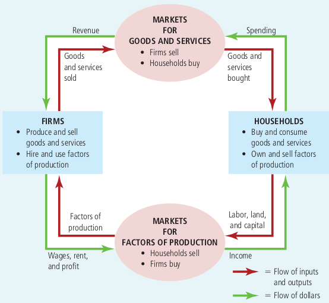
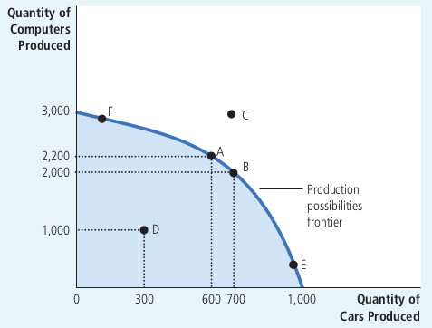
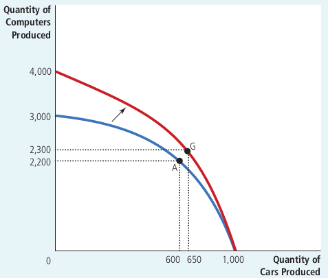

# Thinking Like an Economist

It is helpful to have an overview of how economists approach the world. 
This chapter discusses the field's methodology.

## The Economist as Scientist

The essence of science is the *scientific method* - the dispassionate (without prejudice) development and testing of theories about how the world works.

### The Scientific Method: Observation, Theory, and More Observation

In economics, conducting experiments is often impractical. 
Economists, like astronomers and evolutionary biologists, usually have to make do with whatever data the world happens to give them.

Economists pay close attention to the natural experiments offered by history.

### The Role of Assumptions

Assumptions can simplify the complex world and make it easier to understand. 
To study the effect of international trade, for example, we might assume that the world consists of only two countries and that each country produces only two goods. 
This allows us to focus our thinking on the essence of the problem.

The art in scientific thinking is deciding which assumptions to make.

Economists use different assumptions to answer different questions.
For studying the short-term effects of the government policy that changes the number of dollars in circulation, we may assume that prices do not change much, or are completely fixed.
For studying the long-term effects of the policy, however, we may assume that all prices are completely flexible.

### Economic Models

Economists use models that consists of diagrams and equations.
Economic models omit many details to allow us to see what is truly important.

All models simplify reality to improve our understanding of it.

### Our First Model: The Circular-Flow Diagram

The economy consists of millions of people engaged in many activities. 
To simplify our thinking we heed a model that explains how the economy is organized and how participants in the economy interact with one another.

A **circular-flow diagram** is a visual model of the economy that shows how dollars flow through markets among households and firms.
In this model, the economy is simplified to include only two types of decision makers - firms and households.
Firms produce goods and services using inputs such as labor, land, and capital (buildings and machines).
These inputs are called the *factors of production.* 
Households own the factors of production and consume all the goods and services that the firms produce.

Households and firms interact in two types of markets:

- The *market for goods and services:* households are buyers, and firms are sellers.
- The *market for the factors of production:* households are sellers, and firms are buyers.

What is left from revenue after paying for the factors of production is the profit of the firm owner, who are themselves members of households.

This model is very simple and doesn't includes, for example, the roles of government and international trade.
Yet it is useful to keep in mind when thinking about how the pieces of the economy fit together.

### Our Second Model: The Production Possibilities Frontier

Most economic models are built using the tools of mathematics.

Let's consider an economy that produces only two goods - cars and computers. Together, the car industry and the computer industry use all of the economy's factors of production. 

The **production possibilities frontier** is a graph that shows the various combinations of output - i.e. cars and computers - that the economy can possibly produce given the available factors of production and the available production technology that firms use to turn these factors into output.

The two endpoints of the production possibilities frontier (1,000 cars and 3,000 computers) represent extreme possibilities.

More likely, the economy divides its resources between the two industries, producing some cars and some computers.

Due to resources are scarce, not every conceivable (thinkable) outcome is feasible. For example, economy cannot produce combination of cars and computers represented by point C. With the resources it has, the economy can produce at any point on or inside the production possibilities frontier, but it cannot produce at points outside the frontier.

An outcome is said to be *efficient* if the economy is getting all it can from the scarce resources it has available. Points on (rather that inside) the production possibilities frontier represent efficient levels of production (point A).

Point D represents *inefficient* outcome. For some reason, perhaps widespread unemployment, the economy is producing less than it could from the resources it has available.

The production possibilities frontier shows one *trade-off* that society faces: once we have reached an efficient point on the frontier, the only way of producing more of one good is to produce less of the other.

The frontier shows the *opportunity cost* (the cost of something is what you give up to get it) of one good as measured in terms of the other good. When society moves from point A to point B, it gives up 200 computers to get 100 additional cars. That is, at point A, the opportunity cost of 100 cars is 200 computers (the slope of the frontier).

The opportunity cost of a car is highest when the economy is producing many cars and few computers, such as at point E, where the frontier is steep. When the economy is producing few cars and many computers, such as at point F, the frontier is flatter, and the opportunity cost of a car is lower.

Economists believe that production possibilities frontiers often has this bowed (curved) shape. At point F, the opportunity cost of a car in terms of computers is small due to almost all of the resources, including not-good-at-computers autoworkers, are allocated for producing computers. At point E, the situation is opposite, and the opportunity cost of a car is high due to the best computer technicians are occupied building cars. 

The frontier shows the trade-off, but the trade-off can change over time. For example, a technological advance can raise computers production. This advance expands society's set of opportunities.

If the economy moves from point A to point G, then the production of both cars and computers increases.

The production possibilities frontier simplifies a complex economy to highlight some basic but powerful ideas: scarcity, efficiency, trade-offs, opportunity cost, and economic growth.
