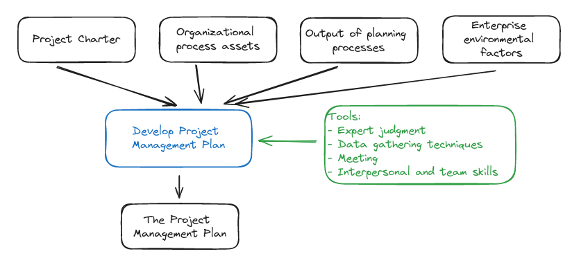
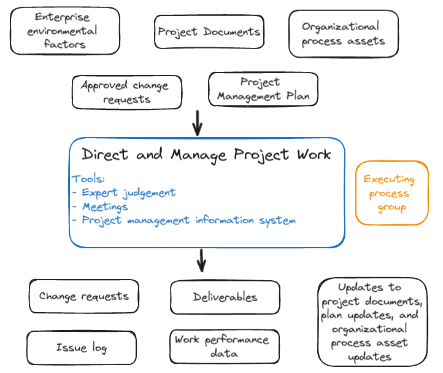

# Project Integration Management

> Getting the job done

... missed part

## Plan you project!

The **Develop Project management Plan** process is where you organize information about your project into on place, so every stakeholder is well informed about things to do.

## The Project Management plan lets you plan ahead

The **Planning** process group is where you

- plan *before* team wll do the job
- figure out how to handle possible *changes*

### The Project Management plan is a collection of other plans

**Subsidiary plans** dedicated to a knowledge area and the specific approach to planning related to that area.

The Project Management plan also has baselines.

Baseline
: A snapshot of the scope, schedule, or budget that can be used in planning and to keep track the changes.

The Scope Management plan
: Describes how to handle scope changes

The Requirements Management plan
: How to collect, manage and meet stakeholders' needs

The Schedule Management plan
: How to handle changes to the schedule

The Cost Management plan
: How to create and manage the budget

The Quality Management plan
: What to do if requirements' acceptance criteria are not met

The Resource Management plan
: How to deal with changes in staff, and other resource constraints

The Communications Management plan
: Ways to communicate with stakeholders

The Risk Management plan
: How to address each risk when and if it occurs

The Procurement Management plan
: How to deal with vendors

The Stakeholder Management plan
: Managing expectations of the stakeholders

**Bullet Points:**

- The Project Management plan is **formal** - it's **written down** and **distributed** to your team. Same as for the project charter.
- You **always** being dealing with change by **consulting the Project Management plan**.
- The **project management information system** is a part of the organization's enterprise environmental factors.

## The Direct and Manage Project Work process

The process implies that you simply follows the plan and handle any problems that come up. You job is to direct and manage each activity on the project.

## The project team creates **deliverables**

Deliverables
: "Something" produced by the project (project artifacts, goods, services, etc.)

Work performance data
: Reports to keep track on how project is doing and how team is working

You create **work performance data** by measuring how and when the processes from each knowledge area are being performed.
