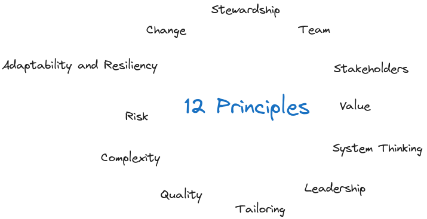

# Project Management Principles

Principles serve for:

- strategy
- decision-making
- problem solving

Principles are guidelines, not prescriptive.

Principles *can* reflect morals.

Code of ethics *reflects* morals:

- Responsibility
- Respect
- Fairness
- Honesty

- [Stewardship](stewardship.md)
