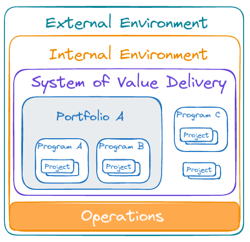
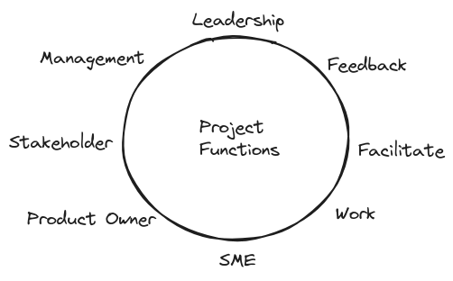
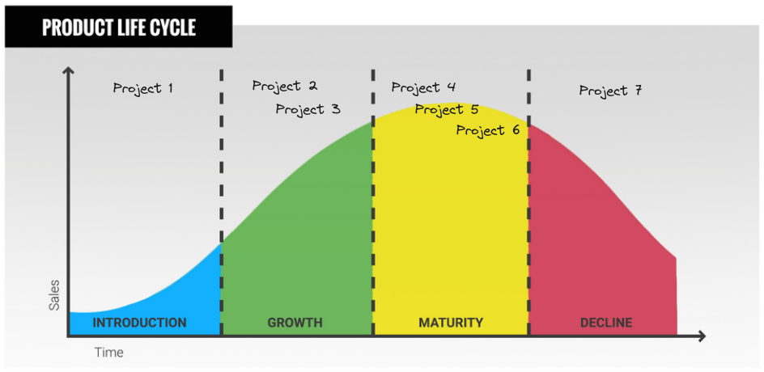

# PMI PMBOK - The Standard for Project Management

A basis for project management understanding leads to intended outcomes.

1. [Key concepts](#key-concepts)
2. [A System for Value Delivery](#a-system-for-value-delivery)
3. [Value Delivery Components](#value-delivery-components)
4. [Organizational Governance System](#organizational-governance-system)
5. [Functions Associated with Projects](#functions-associated-with-projects)
6. [Internal and external environments](#project-is-influenced-by-internal-and-external-environments)
7. [Product Management](#product-management)

## Key Concepts

Project
: a *temporary* endeavor

Program
: a set of projects, when project along cannot achieve outcome

Portfolio
: a set of projects and programs for *strategic* achievements

Outcome
: a benefit/value as a project's result

Product
: a produced artifacts, used by users

Customer
: somebody, who has *requested* or funded the project

User
: somebody, who *uses* project deliverables

Stakeholder
: somebody who may affect, or be affected by the project

Value
: the worth, importance, or usefulness of something

PMBOK
: Project management book of knowledge

## A System for Value Delivery

Organizations generate *value* for stakeholders.

Values are:

- product or service
- social or environmental contribution
- maintaining value generation from the other projects

## Value Delivery Components

A system is a part of organization's *internal* environment.

Organization itself is a part of *external* environment, like global economy.

Components -> Deliverables -> Outcomes -> Benefits -> Value

## Organizational Governance System

Governance supports value delivery system:

- oversight
- control
- assessment
- integration
- decision making

Governance can be:

- organizational
- program
- project

## Functions Associated with Projects

*People* drive project delivery.

Effective *coordinating* of a collective work is a key.

Coordinating can be:

- **centralized** (leadership)
- **decentralized** (self-organizing)

**Supportive leadership** combines both of the coordinating approaches.

Collective effort leads to outcomes and value.

Project functions are:

- [oversight and coordination](#oversight-and-coordination-orchestrating)
- [present objectives and feedback](#present-objectives-and-feedback)
- [facilitate and support](#facilitate-and-support-scrum-master)
- [perform work and coordinate insights](#perform-work-and-contribute-insights)
- [apply expertise](#apply-expertise-sme)
- [provide business direction and insight](#provide-business-direction-and-insight)
- [provide resources and direction](#provide-resources-and-direction)
- [maintain governance](#maintain-governance)

### Oversight and coordination (orchestrating)

- leading planning
- monitoring and controlling activities
- activities evaluation and analysis
- consulting with leadership

### Present objectives and feedback

- contribute directions and insight from customers and users
- get feedback from customers and users

### Facilitate and support (Scrum Master)

- encourage team members participation and collaboration
- share accountability
- solution consensus and conflict resolution
- addressing obstacles
- coordinating meetings

### Perform work and contribute insights

- produce the product and outcomes of the project
- get insights from cross-functional team members

### Apply expertise (SME)

- get contribution from subject matter experts

### Provide business direction and insight

- A product owner role to guide, direct, and prioritize product outcome

### Provide resources and direction

- facilitate connection between management and project team
- transfer vision and objectives from stakeholders
- escalate issues from the team

### Maintain governance

- approve recommendations of the team
- monitor project progress
- link between project and strategic objectives

## Project is influenced by internal and external environments

Internal environments:

- people
- artifacts
- internal knowledge
- practices
- processes
- infrastructure
- resources

External environments:

- market condition
- social and cultural factors
- regulatory environment
- commercial databases
- academic researches
- industry standards
- financial considerations
- physical environment

## Product Management

A product
: An artifact that is produced, is quantifiable.

Product management
: integration of people, data, processes, and systems to create, maintain, and develop product and services throughout its life cycle.

Product management may initiate programs or projects at any point in the product live cycle.

Product life cycle:

Product Management variations:

- Program management within  a product life cycle
  - for large and long running products
- Project management within a product life cycle
  - product as ongoing business activity
- Product management within a program
  - full product life cycle within the program boundary
