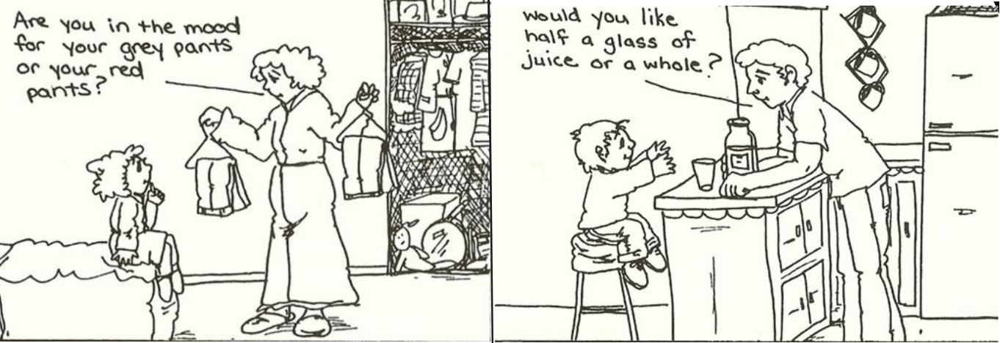
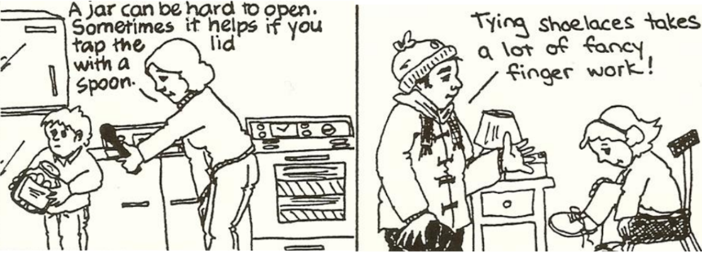
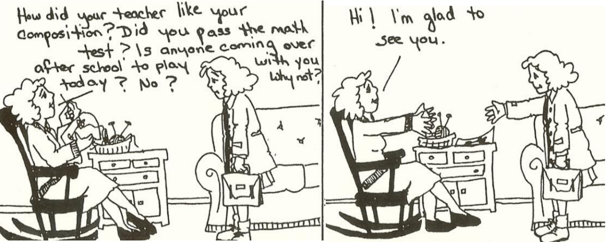
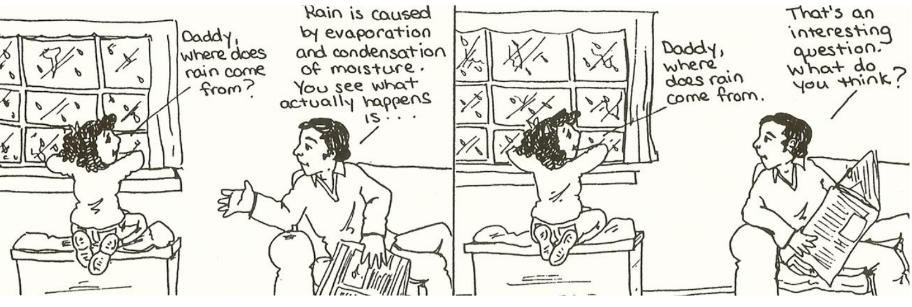
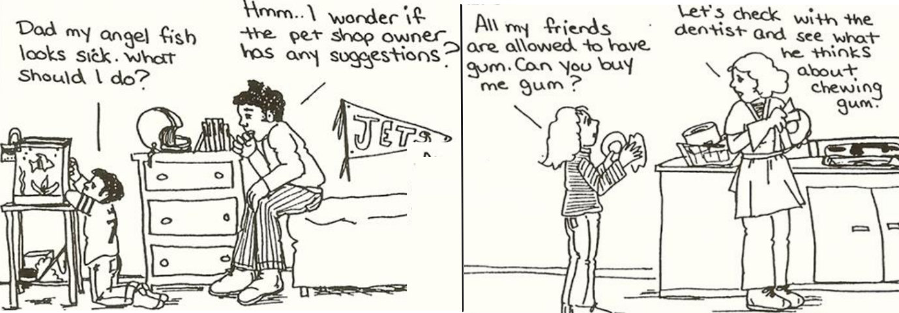
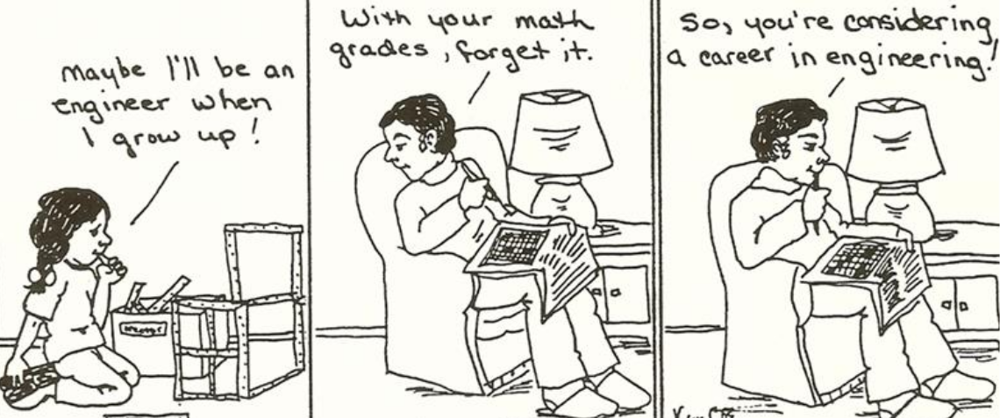

# Encouraging autonomy

Toddlers and teenagers aren't that different...

- [Lets children make choices]()
- [Show respect for a child's struggle]()
- [Don't ask too many questions]()
- [Don't rush to answer questions]()
- [Encourage children to use sources outside the home]()
- [Don't take away hope]()

## Lets children make choices

These are all choices that give a child valuable practice in making decisions. It must be very hard to be an adult who is forced to make decisions about career, lifestyle, mate without having had a good deal of experience in exercising your own judgment.

## Show respect for a child's struggle

When a child's struggle is respected, he gathers courage to see a job through by himself.

## Don't ask too many questions

Too many questions can be experienced as an invasion of one's private life. Children will talk about what they want to talk about when they want to talk about it.

## Don't rush to answer questions

When children ask questions, they deserve the chance to explore the answer for themselves first.

## Encourage children to use sources outside the home

We want our children to know that they're not completely dependent upon us.The world outside the home - the pet shop, the dentist, the school, an older child - can all be called upon to help them with their problems.

## Don't take away hope

Instead of preparing children for disappointment, let them explore and experience.

By trying to protect children from disappointment, we protect them form hoping, striving, dreaming, and sometimes from achieving their dreams.
