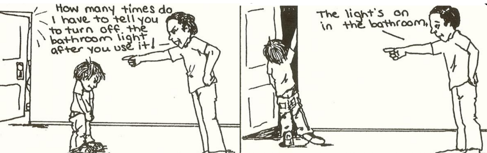
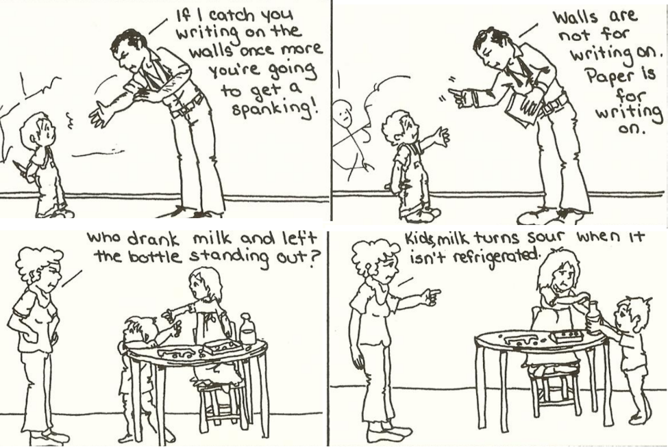
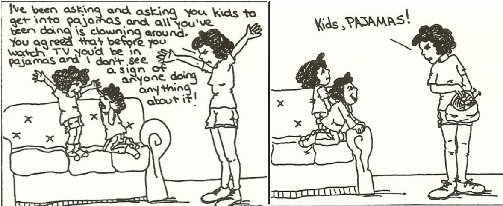
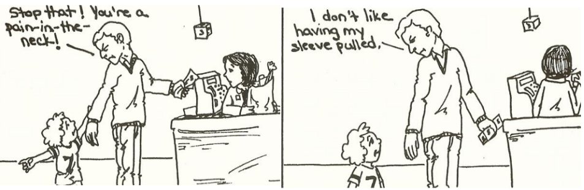
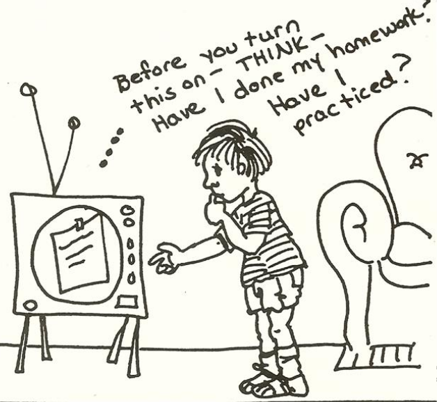

# Engaging cooperation

What we do:

- Blame
- Name-call
- Threaten
- Lecture
- Compare

What we **shall** do:

- [Describe what you see or describe the problem](#describe)
- [Give information](#give-information)
- [Say it with a word](#say-in-with-a-word)
- [Describe what you feel](#talk-about-your-feelings)
- [Write a note (sing a song?!)](#write-a-note)
- No emotional "hooks"

## Describe

It's hard to do what needs to be done when people are telling you what's wrong with you. It's easier to concentrate on the problem when someone just describes it to you. When grownups describe the problem, it gives children a chance to tell themselves what to do.

## Give information

Information is a lot easier to take than accusation. When children are given information, they can usually figure out for themselves what needs to be done.

## Say in with a word

Children dislike hearing lectures, sermons, and long explanations. For them, the shorter the reminder, the better.

## Talk about your feelings

Children are entitled to hear their parent's honest feelings. Be describing what we feel, we can be genuine without being *hurtful*.

## Write a note

Sometimes nothing we say is as effective as the written word.

[Home](index.md) | [Top](#engaging-cooperation) | [Next]()
