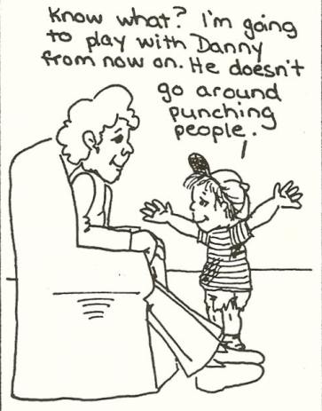
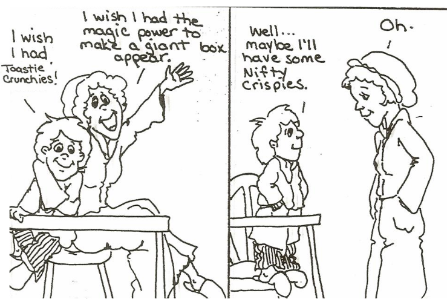

# Helping children deal with their Feelings

Children need to have their feelings accepted and respected

- [Listen quietly and attentively](#listen-quietly-and-attentively)
- [Acknowledge their feelings with a word](#acknowledge-their-feelings-with-a-word)
- [Give the feeling a name](#give-the-feeling-a-name)
- [Give the child his wishes in fantasy](#give-the-child-his-wishes-in-fantasy)

All feelings can be accepted. Certain actions **must be** limited.

## Listen quietly and attentively

Instead of half-listening,

Listen with **full attention**.

It can be discouraging to try to get through to someone who gives only lip service to listening, It's much easier to tell your troubles to a parent who is really listening. He doesn't even have to say anything. Often a sympathetic silence is all a child needs.

## Acknowledge their feelings with a word

Instead of questions and advice,

Acknowledge their feelings with a word "Oh...Mmmm...I see"

It's hard for a child to think clearly or constructively when someone is **questioning**, **blaming**, or **advising** her. There's a lot of help to be had from a simple "Oh..umm.." or "I see". Words like these, coupled with a caring attitude, are invitations to a child to *explore her own thoughts and feelings*, and possibly come up with *her own solutions*.

## Give the feeling a name

Instead of denying the feeling,

Give the feeling **a name**

Parents don't usually give this kind of response, because they fear that by giving a name to the feeling, they'll make it worse. Just the opposite is true. The child who hears the words for what he is experiencing is deeply comforted. Someone has acknowledged his inner experience.

## Give the child his wishes in fantasy

Instead of explanation and logic,

Give a child his **wishes** and **fantasy**

When children want something they can't have, adults usually respond with logical explanations of why they can't have it. Often the harder we explain, the harder they protest. Sometimes just having someone understands how much you want something makes reality easier to bear.

[Home](index.md) | [Top](#helping-children-deal-with-their-feelings) | [Next](engaging.md)
